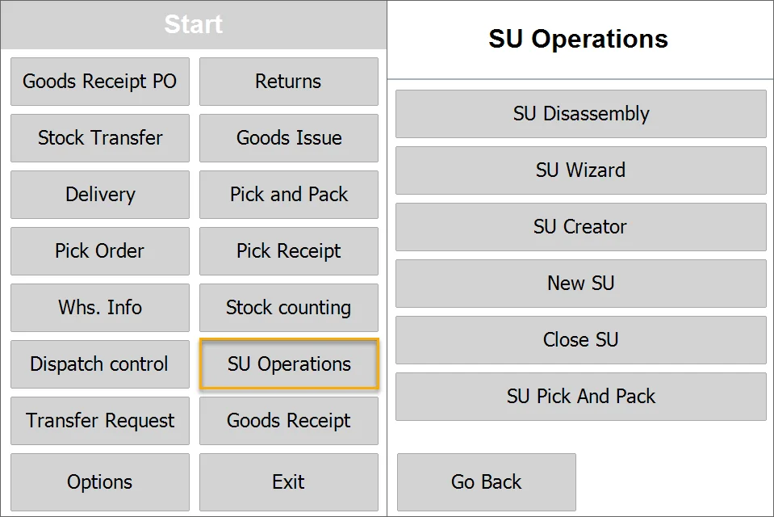

# Overview

:::warning
    **Known Limitation**

    Currently, there is no Storage Unit element in the SAP Business One after installing CompuTec WMS. For a workaround, click [here](./storage-unit-in-sap-business-one-menu-error.md).
:::

:::warning
    Goods packed in Storage Units by CompuTec WMS should not be moved in SAP Business One as it may result in data inconsistency between Storage Unit content and SAP Stock Reports.
:::

Storage Unit (SU) allows to group of Items (and their quantities) and use this group during document creation, e.g., adding an SU to a document adds all its Items.

Physically, SU can be a pallet on which Items are stored and transported.

Using CompuTec WMS, it is possible to create SUs, browse them, and add them to a document.

SUs can be used in every CompuTec WMS transaction.

Created SUs can be browsed in SAP Business One. Click here to find out more.

Click the 'SU Operations' option in the main menu to go to related options:

