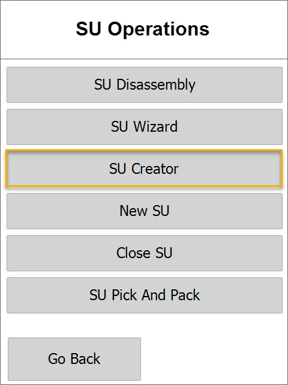

# SU Creator

Using this option, it is possible to create a number of SUs with the same content.

1. Choose SU Operations from the Main Menu.

    
2. Choose SU Creator.

    
3. Choose a Warehouse in which a Storage Unit will be created.

    
4. Select SU content form will be opened. You can add Items that must be included in the created Storage Unit. Click the '+' icon to add Items.

    
5. The Item Selection form will be opened. Choose the Item required to be included in the created Storage Unit.

    
6. Set the Quantity for the chosen Item and click the 'Save' icon.

    
7. Click the 'Next' icon after choosing Items required for SU and its quantity.

    
8. Define how many SUs with a defined set of Items will be created and click the 'Next' icon.

    
9. A list of creating SUs will be displayed. Click a specific SU row to display its content.

    
10. Click a row of specific Items to set its details (Batch, Serial).

    
11. Select Batch (if Batches manage the Item) or Serial Number (for every Item, if Serial Numbers manage the Item).

    
12. Set Quantity (Items can be chosen from different Batches) and click the 'Next" arrow.

    
13. Click the 'Save' arrow after setting details for every Item.

    
14. The Save icon saves the defined Storage Units and leads back to the SU Operations form. New Storage Units are created and can be used in other transactions.
