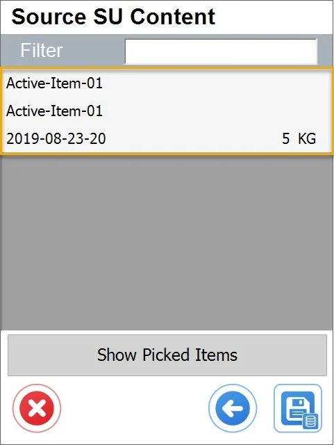

# SU Disassembly

This function allows the disassembled Storage Unit to take Items from it and put them into a Warehouse or another Storage Unit.

---

1. To disassemble a Storage unit, choose the right option in the main menu:

    
2. Choose where you want to move Items to. If you choose:

    1. Storage Unit – a new Storage Unit will be created with picked Items in it,
    2. Warehouse – picked Items will be moved to the Warehouse of the source Storage Unit (without assignment to it).

    Click a required button:

    
3. Choose Storage Unit, the content you want to use. Click a required Storage Unit row:

    

    A storage unit can be chosen by scanning a barcode with a storage unit prefix or SSCC prefix. When watching a barcode without a prefix, a code will be interpreted as a storage unit code.
4. Click an Item row to set its quantity.

    

    You can choose an option in this form by scanning a barcode with an Item, Batch, or Serial Number prefix. A code without a prefix will be interpreted as an Item code. If items from different Batches are on the list, scanning an Item code will lead to the list of Batches for the item.
5. Set the required quantity (by typing it in or by setting it by clicking the + and - icons) and click the save icon. Note that it is possible to pick just some of the Items and quantities from SU (and leave the rest in it):

    
6. You can see the list of already picked Items by clicking the right icon:

    
7. The Picked form will be displayed:

    

    Click Show SU Items to go back to the Source SU Content form.
8. Click the Save icon in the Picked or Source SU Content form to save the changes.

    
9. Info message appears:

    
