# SU Pick & Pack

## From Sales Order

SU Pick and Pack from Sales Order

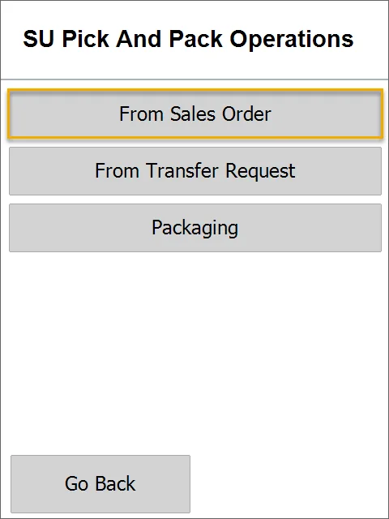

1. After selecting From Sales Order, the Warehouse selection screen opens. You can choose warehouse or just skip that step. Then, the Customer Selection screen opens.

    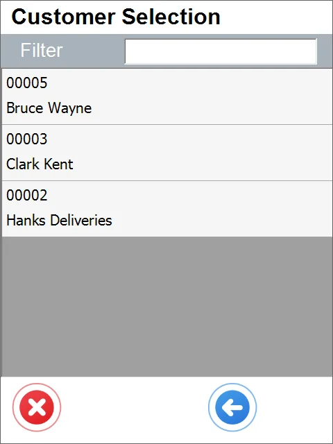
2. Then, the list of orders appears. Select one or more, then press the blue Next button.

    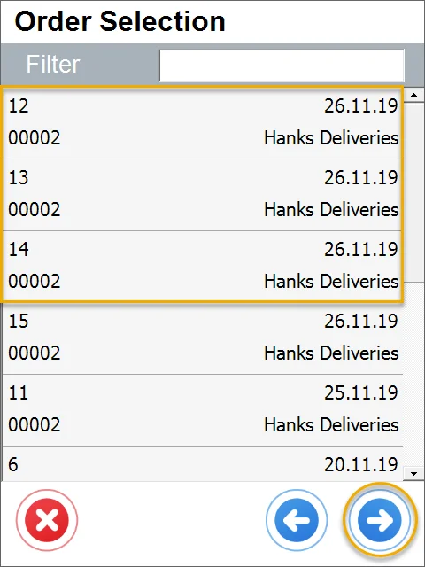
3. Document Details form appears.

    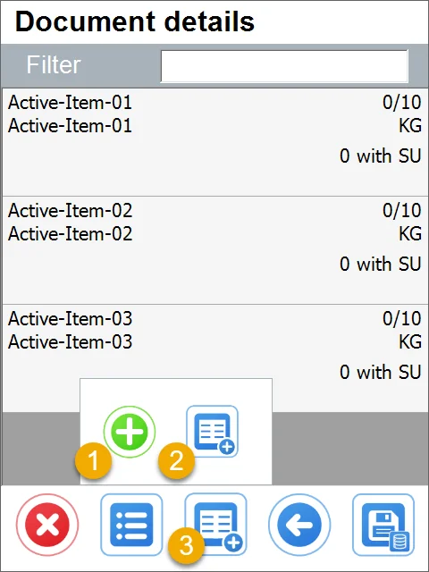
4. Here you can

    1) add a new Item
    2) add a new SU
    3) assemble an SU from the Items on the list.

    or you can just enter each Item's line and choose the required Quantity, Batch / Serial Numbers. If you decide to do this, go to point no. 6 of this manual.

    Upon choosing the assemble option, the Items Document form is displayed:

    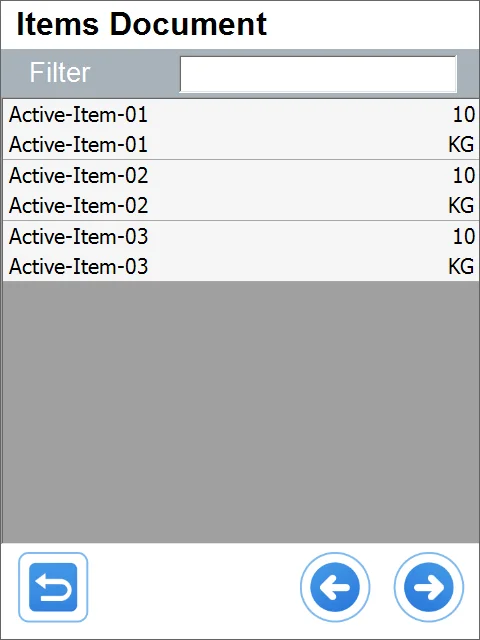
5. Here, choose Items that will be assembled into an SU. Next, click the right arrow icon. It leads to the Storage Unit details form. Here, you can add a new Item or SU or set the required quantity and Batch / Serial Numbers for those already on the list.

    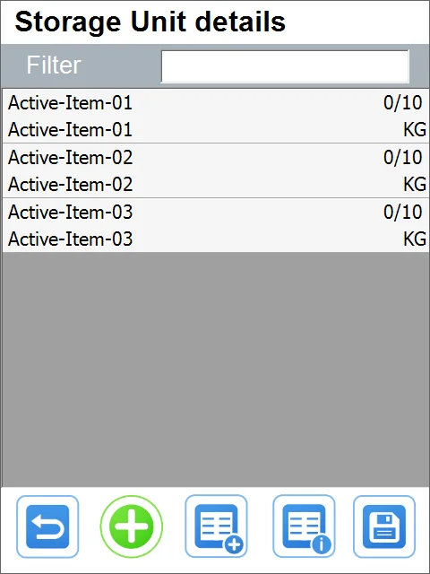
6. Batch form appears. Clicking the plus icon leads to the list of available Batches with quantities.

    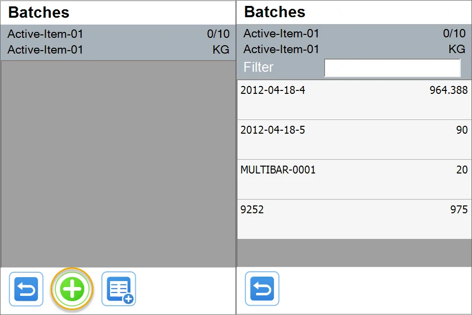
7. The Item row turns green After choosing a Batch and setting the whole quantity.

    If the whole quantity is set, the row stays grey, and in the upper right corner, there is an indication of the picked/total quantity. Click the save button after selecting the whole quantity.

    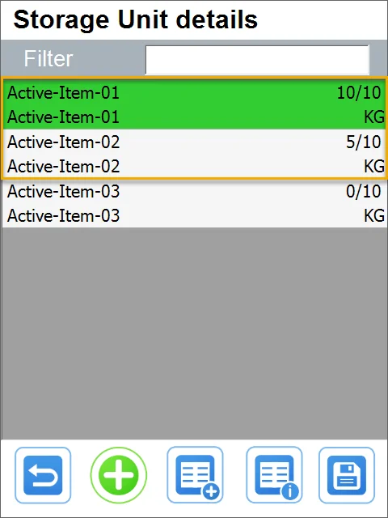
8. Saving Batch and quantity for the SU leads to the Document Details form. You can see the completed Items (marked with green color, with a note that the whole quantities are on the SU) and the added SU:

    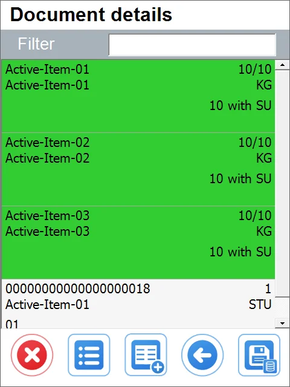
9. Click the save icon. A system message about successful save will be displayed:

    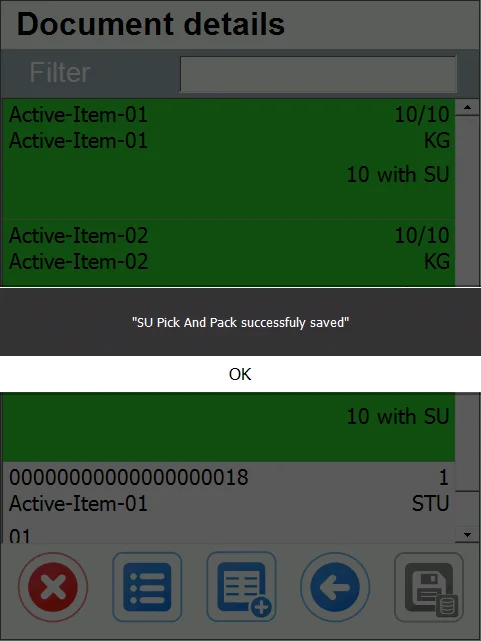

## From Inventory Transfer

SU Pick and pack from Inventory Transfer

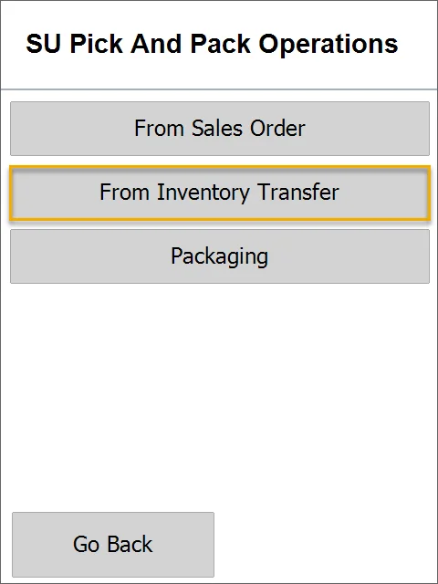

After selecting **From Inventory Transfer**, the Warehouse selection screen opens. You can skip this screen, but you will ask for it when adding items.

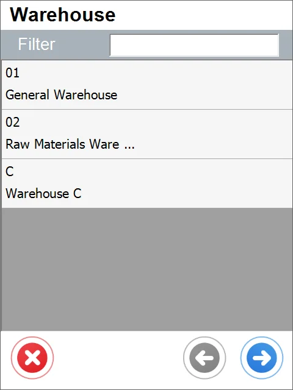

The list of Inventory Transfers for this warehouse opens - select one of the documents.

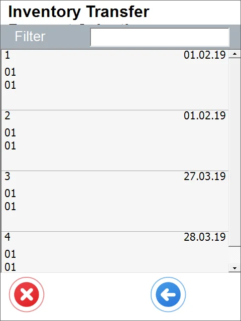

Document Details screen opens - selecting one of the listed items leads to the Storage Info screen.

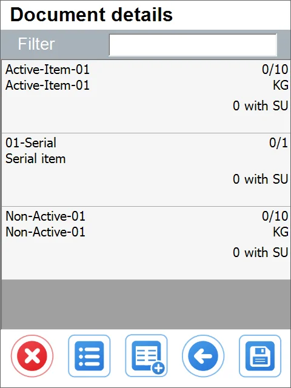

When you select an item managed by none, the Quantity screen opens. You can enter the required quantity of this item.

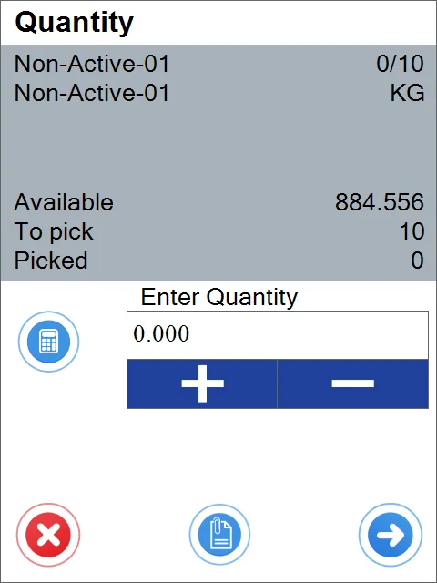

After entering the required quantity and pressing the right arrow button, we return to the Document Details. Non-Active-01 is marked green because all quantity was selected.

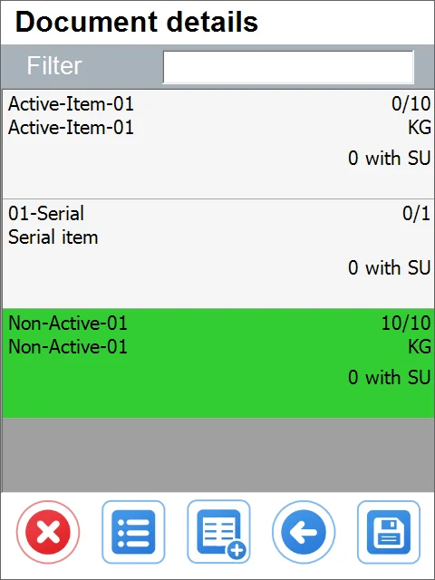

We can add:

1. the item not listed

2. SU not listed

3. SU details.

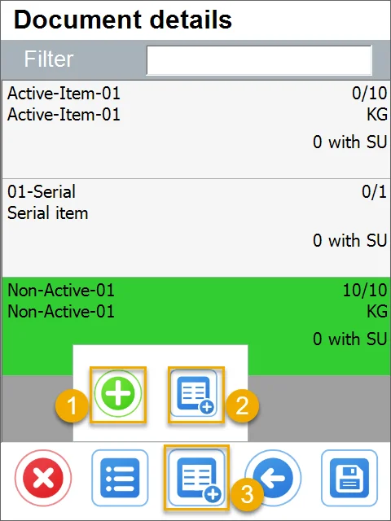
