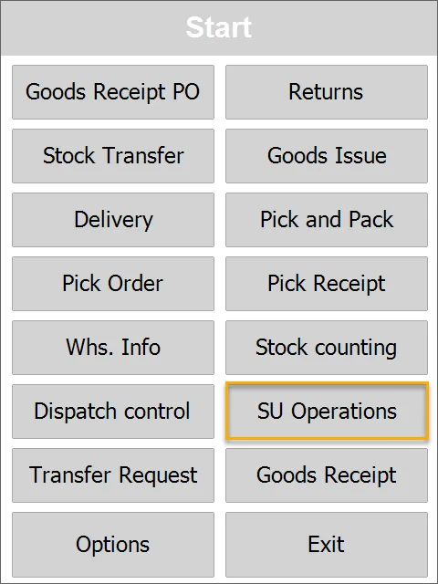
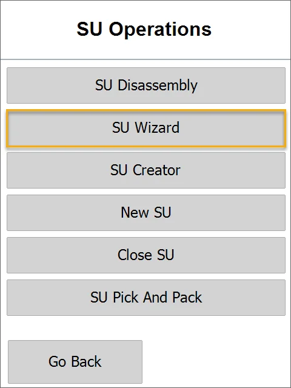
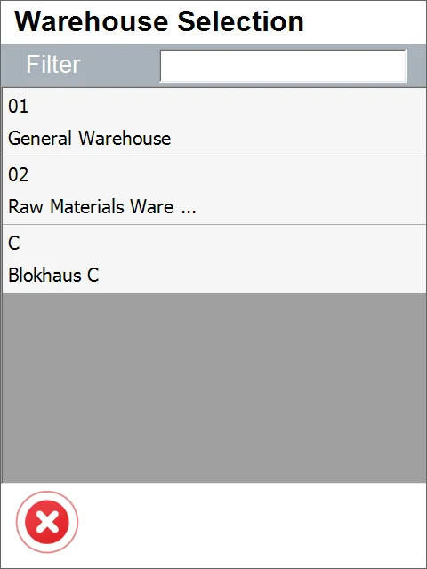
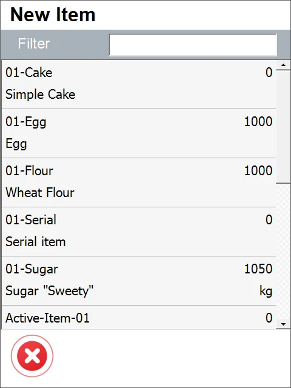
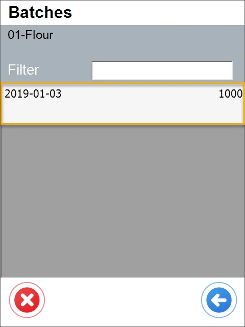
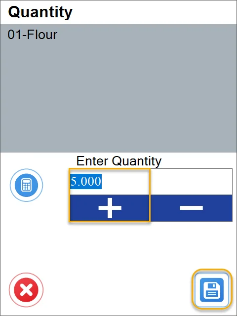

# SU Wizard

This option allows the creation of any number of SUs, all with the same content (Items and quantities). To do this, perform the following steps:

1. Select **SU Operations** from the main menu.

    
2. Select **SU Wizard**.

    
3. Select a Warehouse in which SUs are going to be created. If the chosen Warehouse has Bin locations, you can choose it in the next step.

    
4. Set a number of SUs you want to create and click the right arrow icon.

    
5. Set up a single SU content by adding Items using the '+' icon.

    

    
6. If the chosen Item is managed by Batch, choose it from the list in the next step.

    
7. Set the Quantity for the chosen Item and click the 'Save' icon.

    
8. Click the 'Right Arrow' icon after choosing Items required for SUs and their Quantity.

    
9. A list of created SUs is displayed.

    
10. Click the save icon to save or the left arrow to get back to any of the previous steps.
