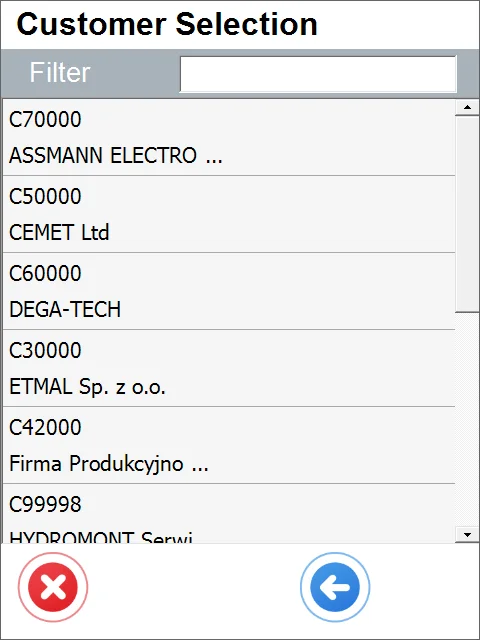
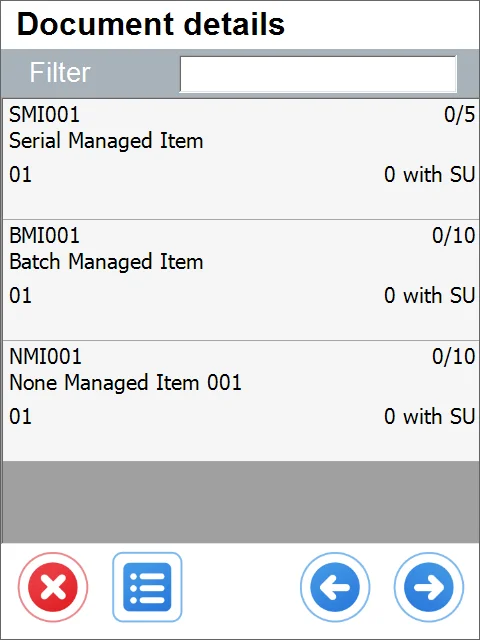
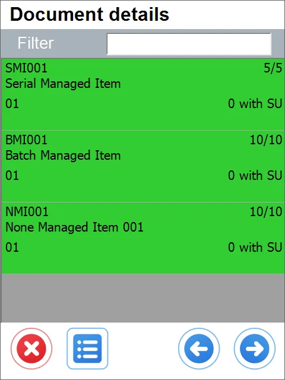
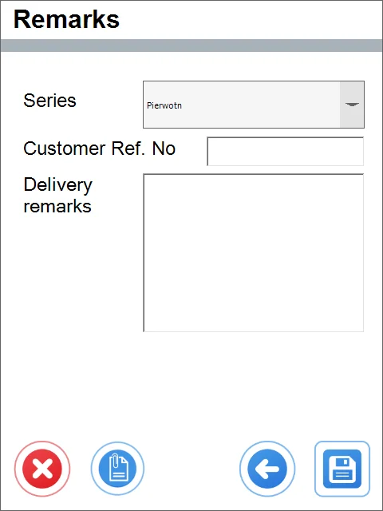

# Customer-Date Workflow

The following description applies to the Customer-Date workflow. Click here to check how to choose a workflow for the Delivery document.

Customer-Date workflow allows one to choose Customer first and then a specific date on completing the information on a document. This way, we can easily browse through documents for this Customer any day. This workflow is practical when we want instant access to information on which dates documents are planned for a specific Customer.

---

## From Pick List

1. Click From Pick List.
2. Select a Customer (all Customers are available; some have no document generated).

    
3. When you select a Customer who has opened a Pick List, the list of Pick Lists displays.

    
4. When you select a document, the Document Details screen opens. Here, you can choose the required quantities for each Item.

    
5. You can add another Item, SU, or confirm quantities of already selected Items.

    
6. After setting the quantities and confirming them, clicking the Next button leads to the Remarks screen.

    
