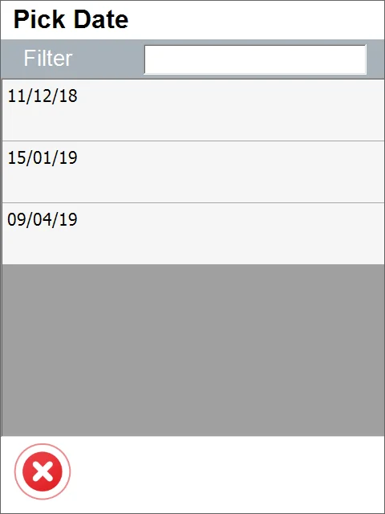
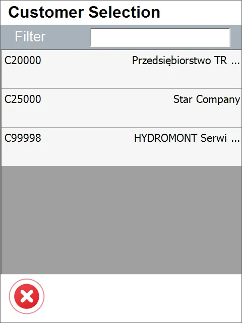
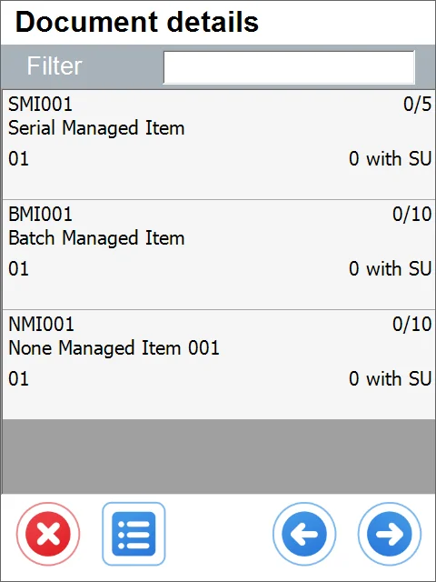
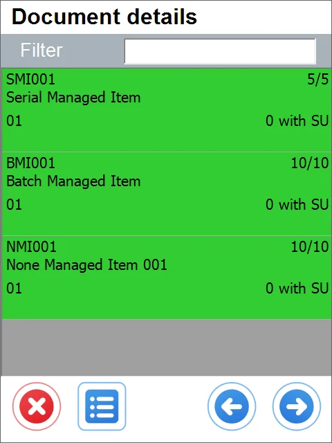
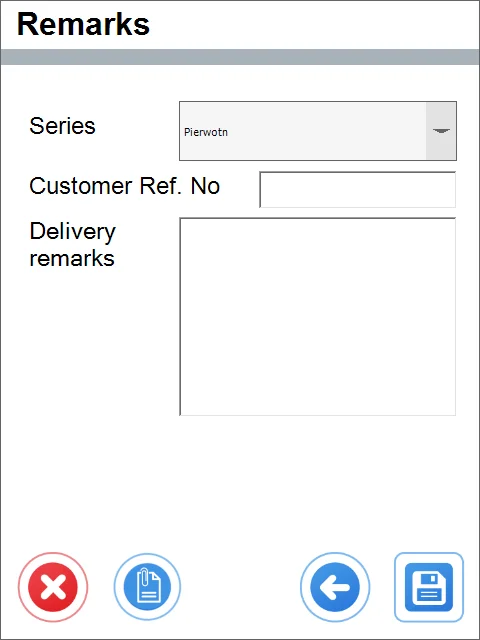

# Date-Customer Workflow

The following description applies to the Date-Customer workflow. Click here to check how to set a workflow for the Delivery document.

The date-customer workflow allows one to choose a date and then specify the Customer on completing the information on a document. This way, we can easily browse through documents for particular dates for any Customer. This workflow is practical when we want instant access to information about documents for which Customers are planning for a specific date.

---

## From Pick List

1. Press From Pick List.
2. Pick Lists with dates are displayed. Select one of them.

    
3. The Customer Selection screen opens. Only Customers that have a Pick List generated for this date are displayed.

    
4. When you select the Customer, the Document Details screen opens.

    
5. Add another Item or SU, confirm the quantities and select Batches and Serial Numbers.

    
6. Press the Next button that leads to the Remarks screen.

    
7. Click the Save icon to save the document.
