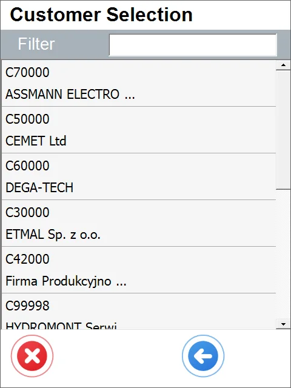
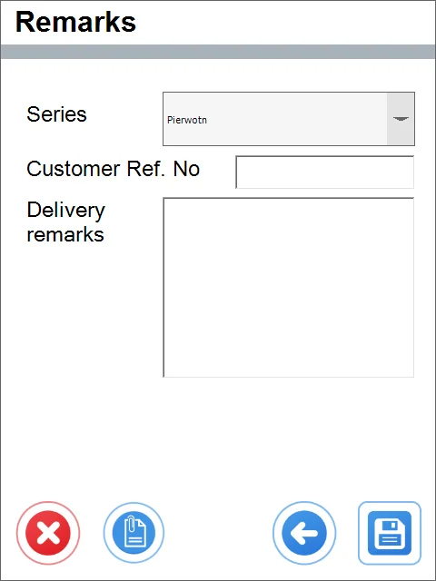

# Default Workflow

The following description applies to the default Delivery workflow. Click here to check how to set a workflow for the Delivery document.

:::note
    Some forms' order and availability during a document's creation may vary depending on individual settings. Click here to find out more.
:::

1. Click the Delivery in the main menu to create a Delivery document.

    

    
2. The Source Warehouse window appears.

    Choose the desired Warehouse by clicking its row.

    

    :::note
        Filtering the records is available in every window where a Filter row is present. You can start it by typing in at least a part of a name, e.g., a part of a warehouse name, in the Warehouse Selection window.
    :::

    

    :::note
        This step may be skipped by clicking the right arrow icon. In this case, Source Warehouse will be available to choose from upon setting the Item details.
    :::

    It is possible to set up a default Warehouse. In this case, the Warehouse Selection screen is skipped, and the Warehouse set as default is chosen automatically.
3. The Customer Selection window will appear.

    Clicking a row of a Customer picks it and leads to another window.

    
4. The Pick Lists window will appear with a list of Pick Lists available for this Warehouse.

    Only Pick Lists with a status different from Closed are displayed. Choose the desired list by clicking its row. You can filter the list by scanning the item code – only Pick Lists with this Item will be displayed.

    
5. The Document Details window will appear.

    Click a row or scan an Item code to choose the correct quantity.

    
6. If a Warehouse has not been chosen in step no. 2, the Source Warehouse form will be displayed now.
7. A From Bin form will appear if Bin Locations manage a Warehouse.

    Click a required Bin row or scan its code.

    
8. The Quantity Window will appear.

    You can change the quantity by scanning it, typing it in, or using the '+' and '-' icon buttons. Click the right arrow icon after choosing the correct quantity to return to the Document Details window.

    
9. If serial numbers manage an item, the Serial Number window appears after clicking an item row.

    Clicking a Serial number row picks it and adds it to the Document Details window. This step should be repeated until obtaining the desired quantity.

    
10. If Batches manages an Item, the Batch window will appear after clicking an item in the Document Details window.

    The Quantity window appears after clicking the desired batch (see no. 8 of this guide).

    
11. Click the menu icon and '+' in the Document details window to add (if necessary) items not included on the pick list (or any of the Sales Orders).

    After that, click an item row and do as follows in point 5 and following this guide (if a source Warehouse was not picked in no 2 of this guide, it is available now).

    

    Click the menu icon and then add the storage unit icon (B) to add a new storage unit to the document:

    Storage Unit form will be displayed; click the SU row to add it to the document:

    

    Click the highlighted icon to see information on a Storage Unit added to the document.

    
12. Click the right arrow icon after setting document details.

    
13. The Remarks window will appear.

    Filling in a reference number field and a remarks field is optional. You can choose a document series (if it is set in a database).

    
14. You can save the document as a draft. Click here to check how to do that.
15. Click the save icon to generate a delivery document.

    
16. A note about the creation of a document is displayed. Click "OK" to finish the transaction.
17. The delivery is posted and is available in SAP Business One.
