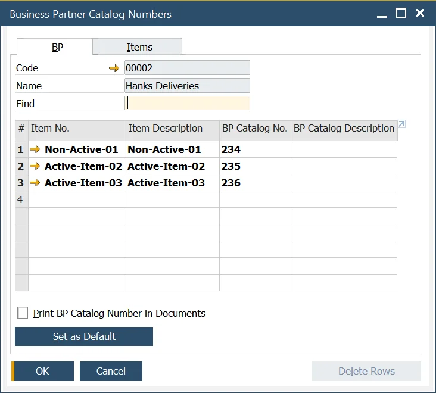
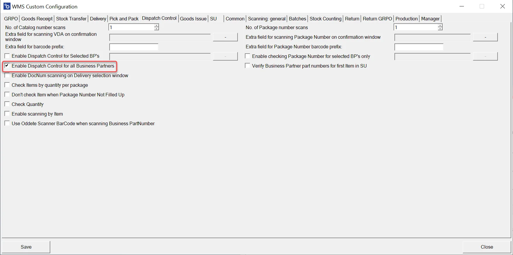
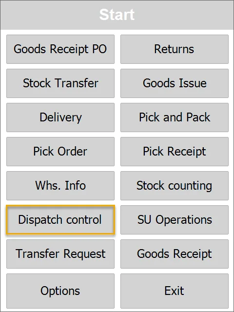
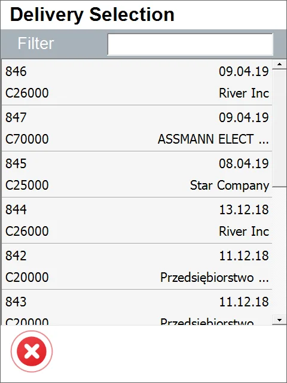
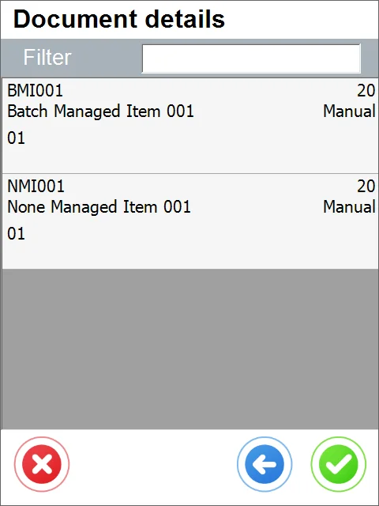
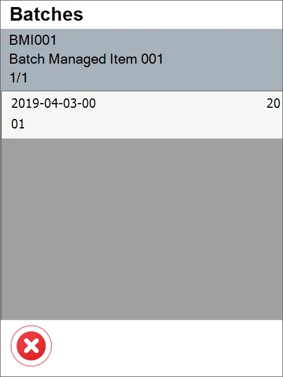
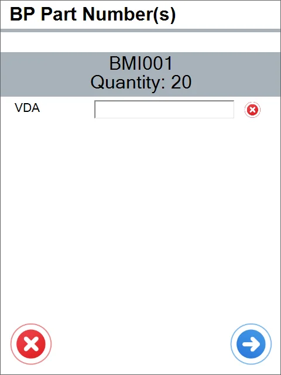
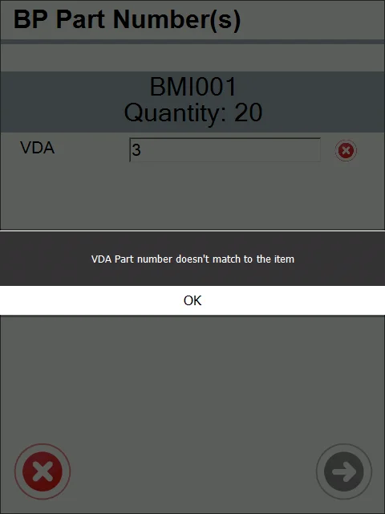

# Dispatch Control

Dispatch Control is an option that allows verifying Items against the Business Partner's catalog numbers (before sending it on Delivery).

---

## Requirements

### Custom Configuration

You can check the Custom Configuration options [here](../../administrator-guide/custom-configuration/custom-configuration-functions/dispatch-control.md).

### SAP Business One

It is required to define Business Partner Catalog Numbers to use the Dispatch Control option. Business Partner Catalog Numbers are numbers assigned to an Item on the BPs side, e.g., on the screenshot below, Active-Item-01 has the following number on the SAP B1 side: Active-Item-01. On the BP side, it is 4.

:::info
    Inventory → Item Management → Business Partner Catalog Numbers
:::



Assigning an Item to a specific Business Partner (BP tab) is possible. Choosing an Item and defining different Catalog numbers for each Business Partner is also possible.

Please check the related SAP Business One documentation entry to learn more about Business Partner Catalog Numbers.

## Transaction

Go to Custom Configuration and select the "Turn on Dispatch Control for all Business Partners" checkbox.



Click on the Dispatch Control button:



Select a row from the Delivery list:



After selecting the row, the Document Details screen appears. Select one of the Items:



If batches manage Items, you have to select Batch:



Now you have to enter the BP Part Number for this specific Item:



If you enter a wrong number, the error message appears:

```text
VDA Part number doesn't match the item
```


