# Goods Issue

Goods Issue documents the company's internal issue of Items or materials.

:::info
    Some forms' order and availability during a document's creation may vary depending on individual settings. Click here to find out more.
:::

---

Choose the correct option on the main menu to create a Goods Issue document.

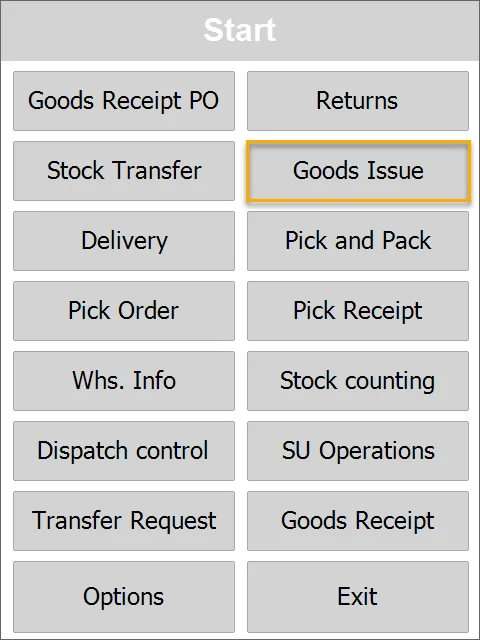

The Source Warehouse form will be displayed.
Choose the desired Warehouse by clicking it. This step can be skipped. In this case, the Source Warehouse selection form will be displayed after choosing a specific Item.
You can choose a Warehouse by scanning a code with a Warehouse prefix or without it.

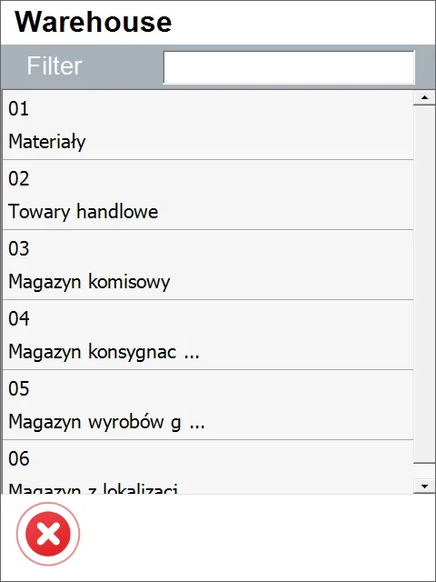

It is possible to set up a default Warehouse. In this case, the Warehouse Selection screen is skipped, and the Warehouse set as default is chosen automatically.

Click the menu icon and then the plus icon to add Items to the document.

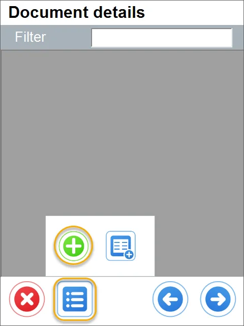

You can scan an Item or SU code in this form, with or without a prefix.

The list of available Items will be displayed. Click a desired Item to add it to the document.

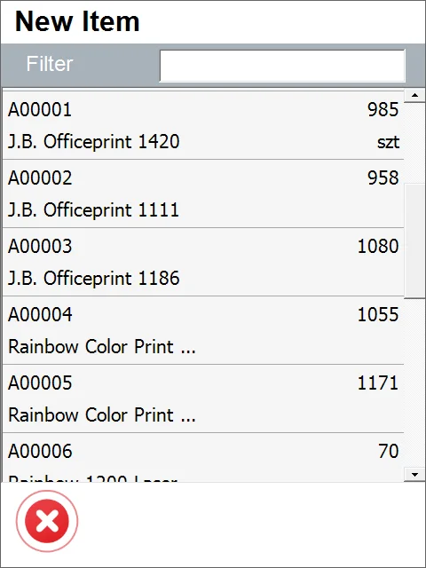

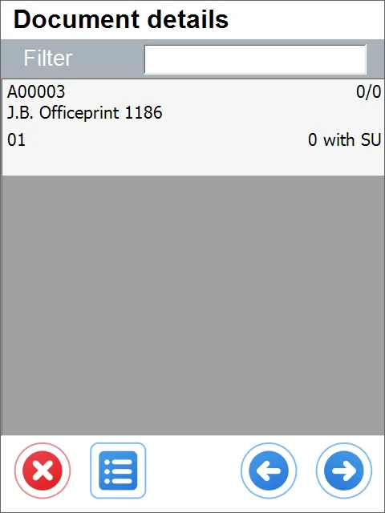

Click the Item row to set its details.

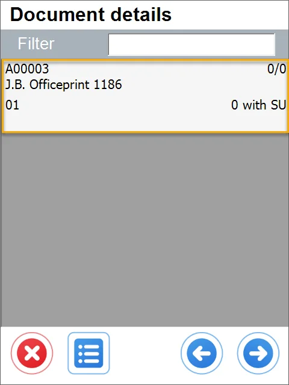

If the Item is managed by serial numbers, a form for choosing it will be displayed.

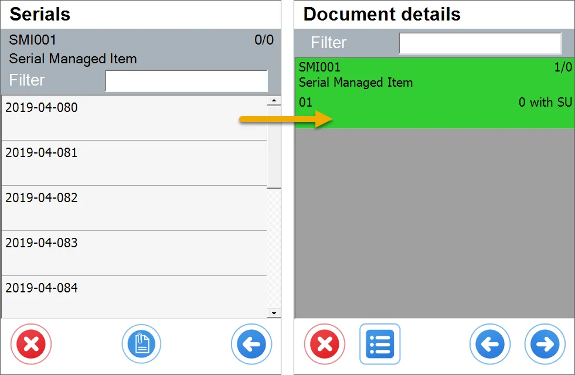

If the Item is managed by Batches, a form for choosing it will be displayed. Click a desired batch to choose from it.

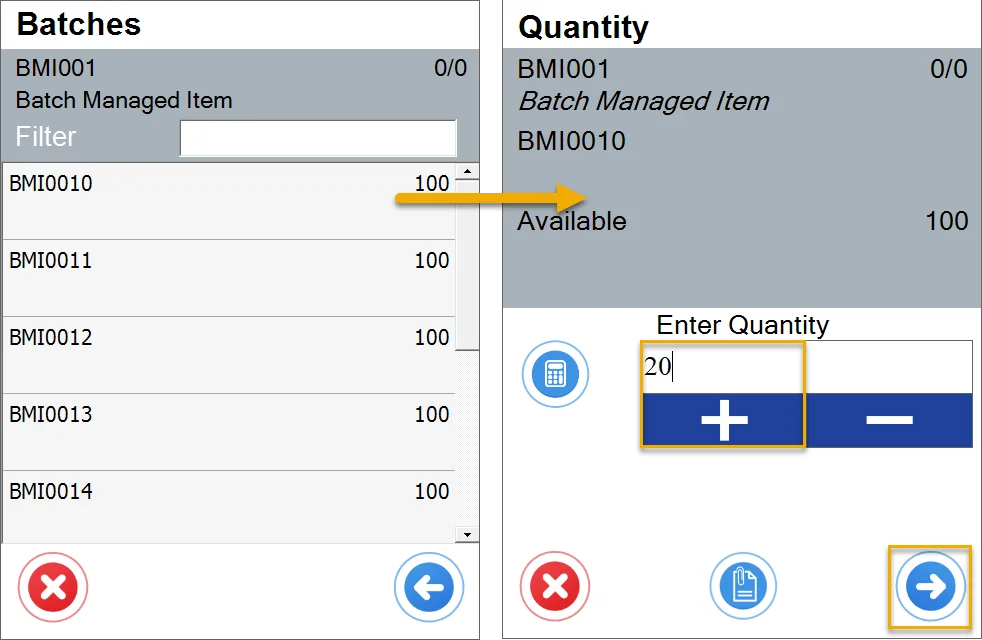

A form for setting quantity will be displayed.
Type in a desired value or set it using the plus and minus buttons and click the right arrow to approve changes.

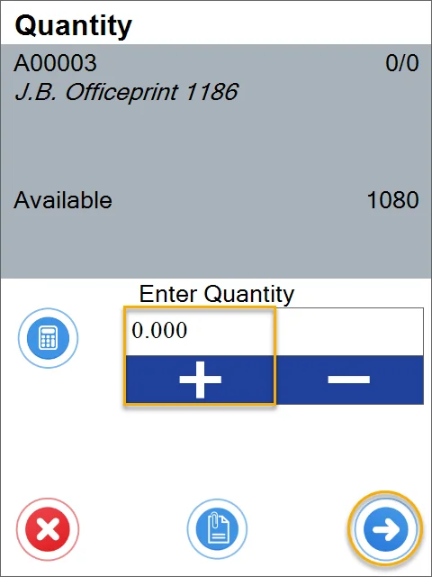

Click the menu icon and then the Storage Unit icon to add a Storage Unit.

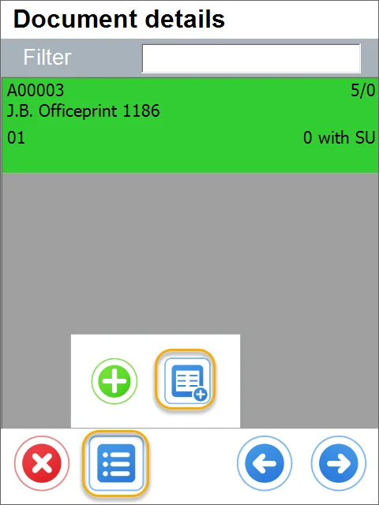

The form for choosing Storage Units will be displayed.
Click a desired Storage Unit to add it to the document.

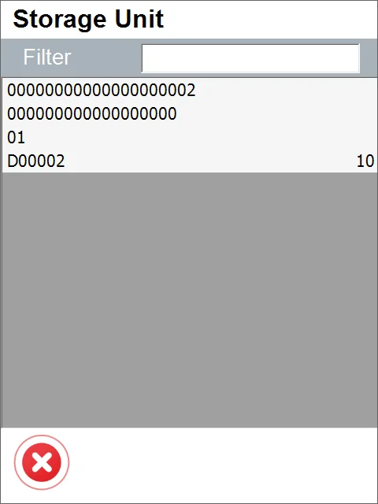

Click the right arrow icon after setting all the details.

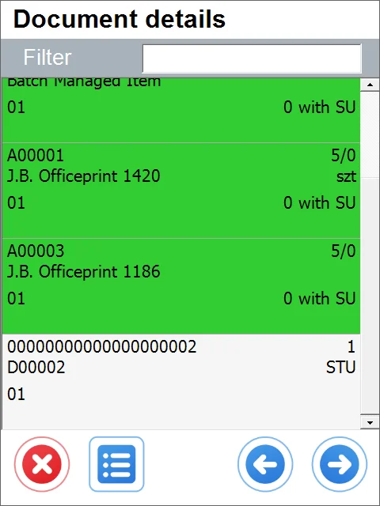

Set the series (if it is preset and required), add Remarks (if needed), and click the save icon.

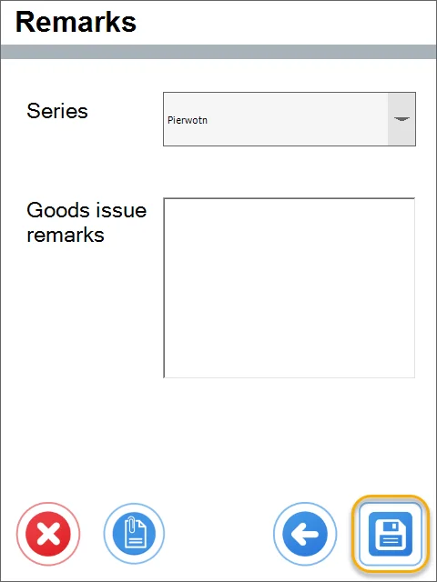

A communication about the document's creation (with its number) will be displayed.

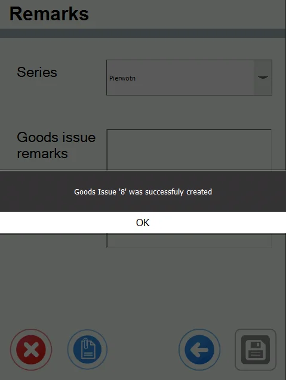

Click OK. The newly created document is now available in the SAP Business One system.
