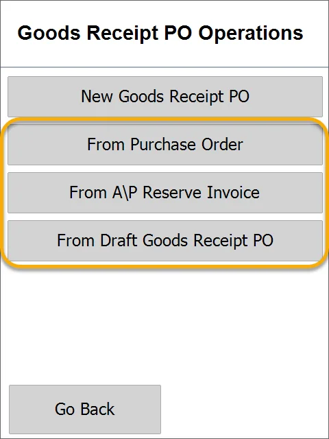
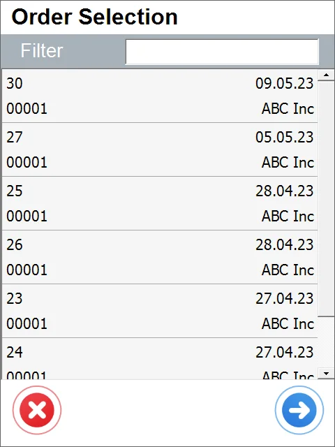
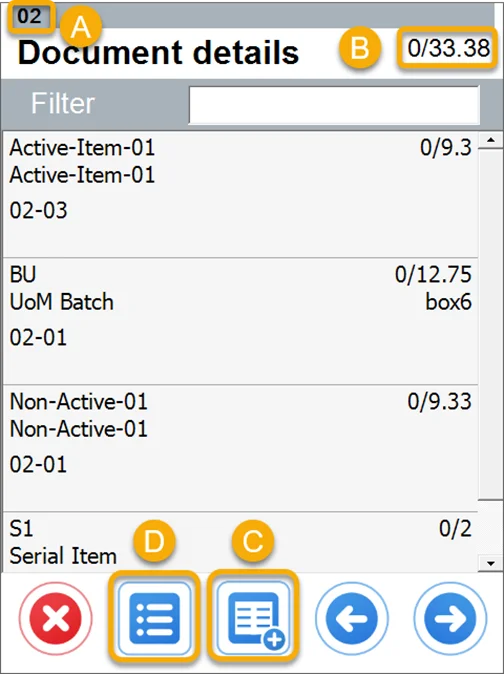
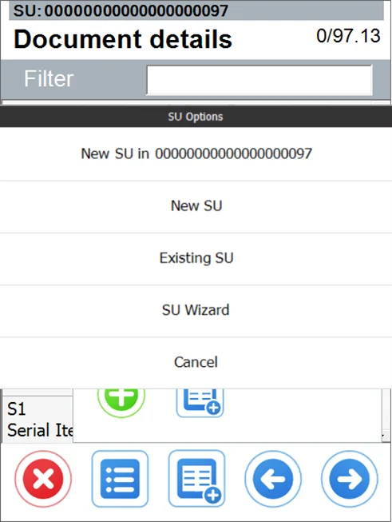
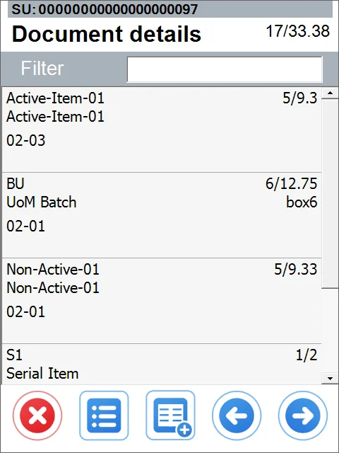
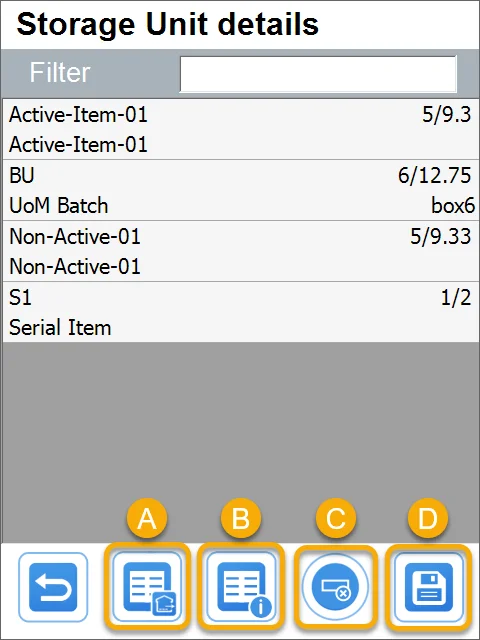
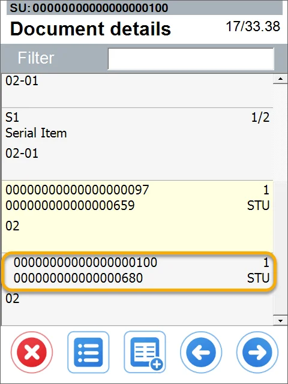
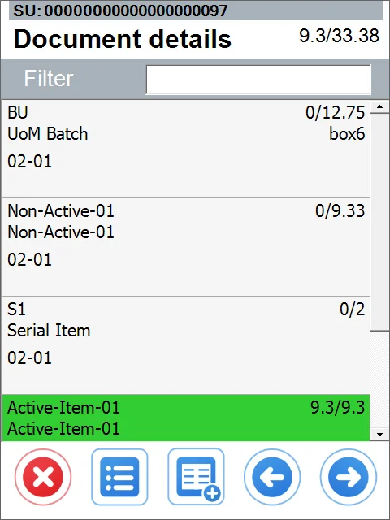
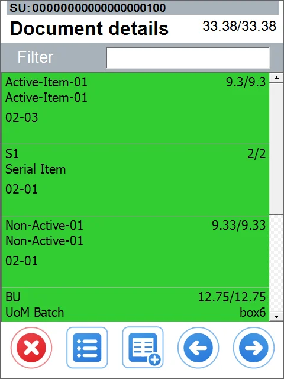
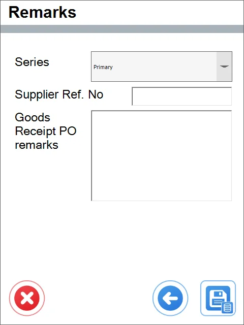

# Based on Existing Document

1. Choose the required type of base document:

    \*Please remember that the GRPO A\P Reserve Invoice has to be realized for the same quantity as in the base document.

    

    UDFs for the header have been added. They display a default Warehouse and Bin Location.
2. Choose a document number by clicking its line. You can also scan a barcode or filter using the filter field.

    
3. There are additional elements in the Document Details screen:

    

    1. A Warehouse to which Items or SUs will be received. This field is filled automatically if all the receipt Items are to the same Warehouse. Otherwise, you must choose it while adding an Item, SU, or by clicking the field.
    2. Picked/Overall Quantity.
    3. New SU button - if the Hide SU option is turned on and the Warehouse is without Bin Location, SU Details will not be displayed.
    4. Tooltip, gdzie możemy dodać nowy indeks lub otwieramy menu SU. A tooltip for adding a new Item or opening the SU menu.

    
4. You can add Items to already existing SU and also to those with Created status (CR).
5. In the SU adding mode and you scan an Item barcode, all the Items go to the SU marked at the top of the screen:

    
6. To leave the SU, click the top bar with its number or scan a barcode of another existing (only on this document) SU.
7. You can also click the SU line on a list to see its details.

    

    1. Exit the SU (or enter, when you are not in the SU adding mode).
    2. SUs UDFs.
    3. Delete SU.
    4. Save changes.
8. If you created an SU within SU, its line will be dented:

    
9. Items added fully are moved to the end of the list.

    
10. You can go to the Remarks when the document is complete.

    
11. Remarks.

    
