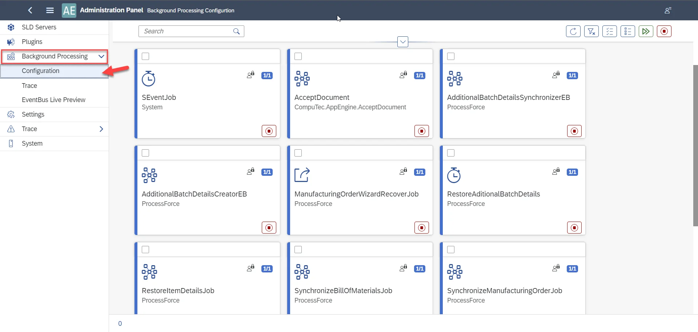
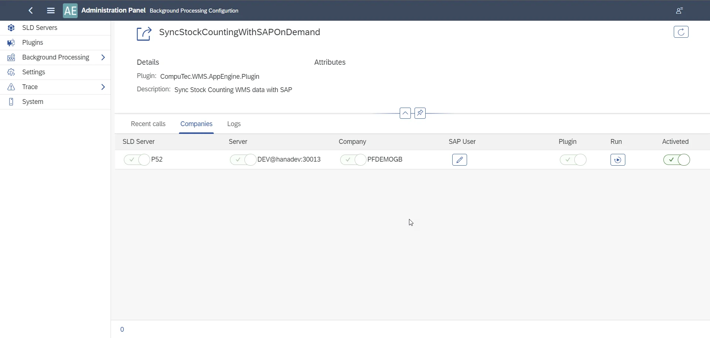

# New Stock Counting Plugin Installation

Here, you can find information about the New Stock Counting plugin installation.

---

## CompuTec WMS Server setting

Please ensure the AppEngine server name address is set in the CompuTec WMS Server settings.

## AppEngine

Turn on AppEngine on a database with ProcessForce:

Type in the address and click Save:

Log in to the AppEngine Administration panel using the following address: http://localhost:54000/webcontent/uaa/webapp/Index.html.

## Plugin installation

Go to the Plugins tab and then click the Install Plugin button:

Choose the file:

:::warning

You have to upgrade the plugin upon upgrading CompuTec WMS.

:::

Go to the plugin after the installation:

Activate the plugin in the Companies section:

## Background Processing

Go to the Background Processing, the Configuration tab:

You can use the filter to find the required jobs:

Mark all three of them and click the highlighted icon:

Mark all three of them and click the highlighted icon:

### Jobs available in the CompuTec WMS plugin in AppEngine

Each of them has to be activated to work correctly.

#### SyncStockCountingWithSAPOnDemand

This job sends information from the CompuTec client to SAP Business One (the Save icon in CompuTec WMS).

#### SyncStockCountingWithSAPRecurring

This job automatically sends data from CompuTec WMS to SAP Business One after 30 minutes.

#### WMSUpdateSUAfterInventoryPosting

This job is responsible for creating Storage Units and their edition during Inventory Posting.

### The result

The AppEngine plugin is required to use the New Stock Counting either with SAP Business One or ProcessForce.

If the plugin is unavailable, there will be information about it in CompuTec WMS.

