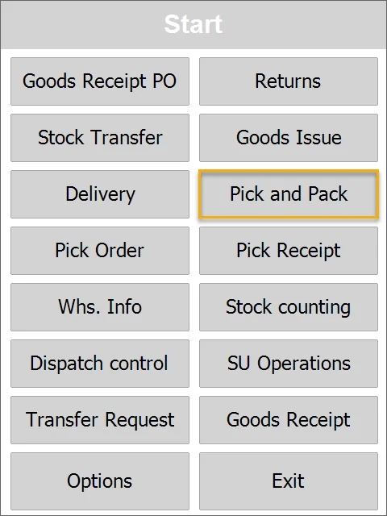
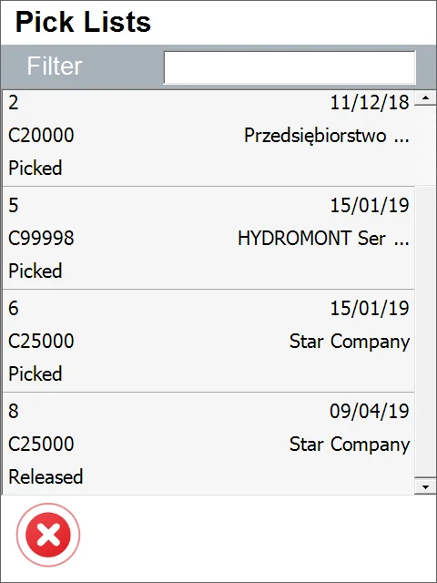
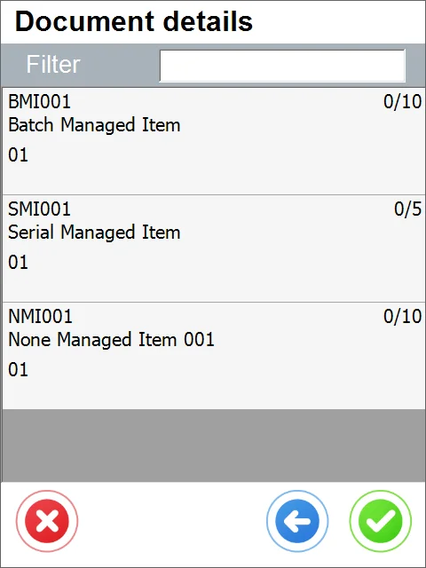
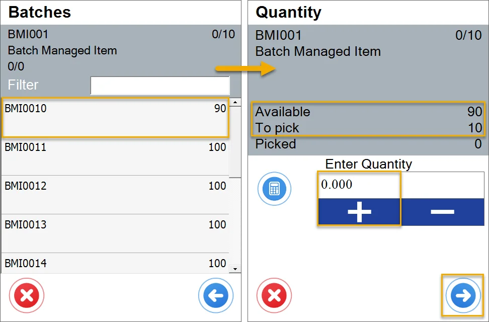
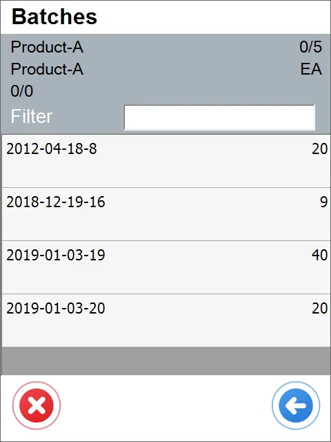
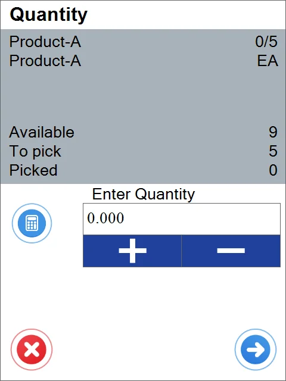
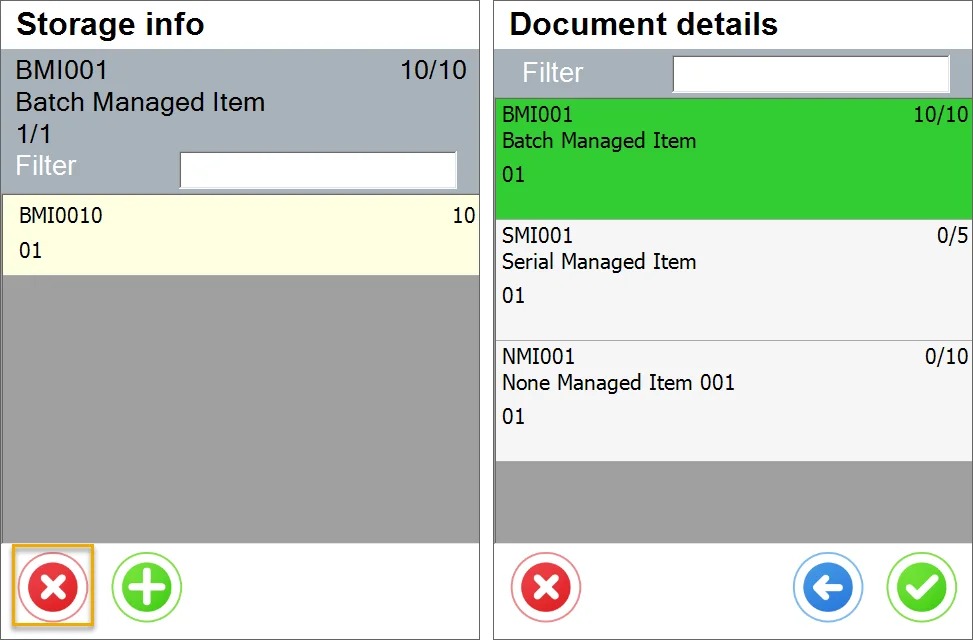
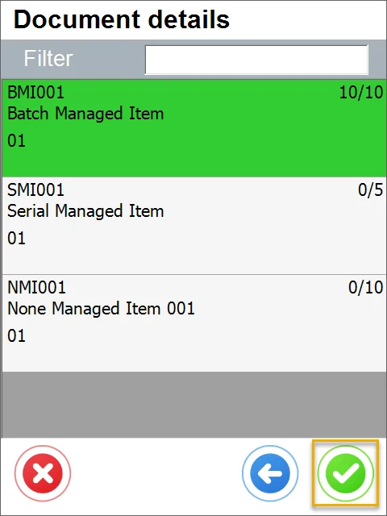

# Old Pick & Pack

:::caution
    Pick and Pack are not supported for Items with ‘Issue Primarily by’ (SAP Business One option) set to ‘Bin Locations.'
:::

**Pick Pack and Production Manager** is an SAP B1 tool that allows the processing of Sales Orders, A/R Reserve Invoices, Production Orders (and ProcessForce Manufacturing Orders), and Inventory Transfer Requests from picking Items from warehouses to sending them to a receiver. It is performed by generating and managing Pick lists and later Delivery documents.

---

1. Select a document from the list:

    
2. Select an Item row to specify its details:

    
3. In this case, the Item is managed by Batches, so choosing it leads to the Batch selection window. Then, it leads to the Quantity screen. We have information about the Item and quantity field.

    

    

    
4. The quantity is added. The item is ready to be picked.

    
5. Now, we need to click the green icon and the Item is picked.

    
6. You can check the document being posted in SAP Business One.
