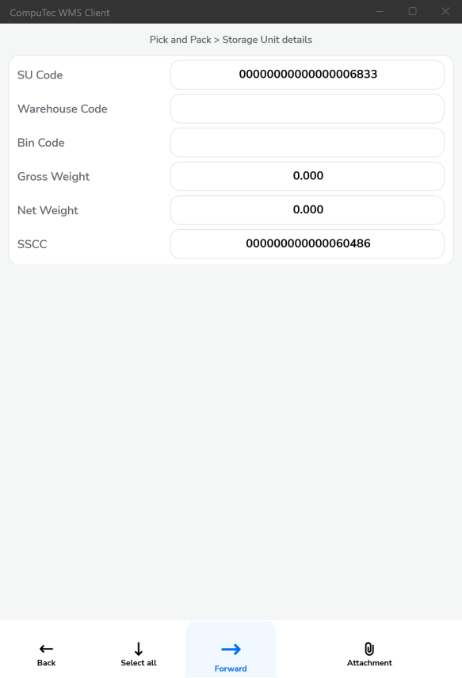
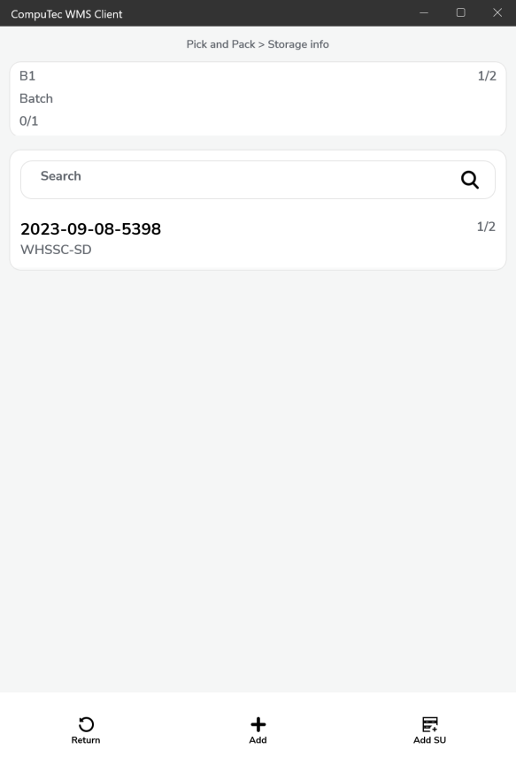

# Pick & Pack

## Support of Storage Units in the Pick and Pack transaction in Computec WMS

1. New SU
2. Existing SU (support only for SUs that have the same Items that are on the Pick List)

A top bar was added – for displaying an SU that is now in packing mode.

The change is related to the Pick List from the following documents:

1. Sales Order
2. Production Orders
3. Reserve Invoices
4. Inventory Transfer Requests

Support for both preallocation and without it (Custom Configuration: it is possible to block picking from different than assigned).

## The list display will be based on Custom Configuration settings

1. Standard (all Pick Lists).

    
2. Customer – Date

    
3. Date – Customer

    

    

## Document Details

:::caution
    All the data is automatically saved during the picking
:::

Buttons:

- Cancel – going back to the main menu.
- More – a dropdown list
- Info – base document header remarks.
- Accept – finishing a Pick List (no the floppy disk button anymore)
- Add SU – adding a Storage Unit

    1. New SU
    2. Existing SU
- Back – going back to the document list.

:::info
    Using Pick List supported.

    Pick List – visible for all selected users:

    Custom Configuration option:

    1. if the picker field is filled, then the pick list is visible only for this picker.

    2. if the picker field is empty in SAP B1, the pick list is visible for everyone + the CC setting.

    The picker is saved, and now only this picker can picker can continue the Pick List.
    Or the picker field stays blank.
:::

Manual and scanning quantity picking stays the same.

## A significant change

Each Item from now on will have a separate line for localization. The same way it is in SAP Business One.

Without preallocation (the bold font for the proposed location, sorted for the picker).

With preallocation (the list sorted for the picker).

Sorting Items by the closest location added (for speeding up the pick and pack process).

## 1. New SU

Choosing a new SU leads to the form.

Buttons:

- Back – canceling an SU – it should be Cancel
- Select all – checking a target Warehouse/Bin for an SU
- Forward – Document Details creation of an SU and move to the Document Details form
- Attachment – move to the UDF for the SU form

After SU is created, its number is displayed in the top bar. It means that the Item collection for this SU is active.

Clicking the top bar leads to an SU.

To choose the SU again, you can scan a code (e.g., SU Code) or select the SU manually from the list.

Buttons:

- Return – Document Details return to the Document Details form
- Search SU – an SU again (it will be displayed in the top bar)
- SU Info – SU information
- Back – go back to the Document Details form
- Remove – removing from the SU list.

When the SU is chosen, clicking the line again opens a form.

Items available in the SU are displayed here. You can also edit them from here.

Buttons:

- Return – go back to the Document Details form
- SU Warehouse – change the target location for the SU
- SU Info – SU information
- Back – go back to the Document Details form
- Remove – remove from the SU list

Editing Quantity is possible directly from the Item line level and by entering a line in the SU.

Editing quantity in SU does not require SU to be loaded in the top bar. You can do in from this level.

## 2. Existing SU

Buttons:

Return, Back – go back to the document Details form

In the case of Existing SU, choosing an SU with the same Items as in the Pick List will be possible

## 3. Preallocation

### 3.1 Bin-managed Warehouse or without Bins when we do not use preallocation

1. None Items

    
    
    
2. Batch Items

    
    
    
    
3. Serial Items

    
    
    

### 3.2 When the preallocation is used

1. None Items

    
    
2. Batch Items

    
    
3. Serial Items

    
    

## 4. Scanning management

## 5. Custom Configuration

1. Pick List availability for users.
2. Allows choosing an Item from a different location.
3. Picking Items only by scanning.
4. Quantity must be confirmed by clicking a button.
5. Allow to pick quantity greater than on the Pick List (to quantity of the base document).
6. Allow only pick and pack of allocated quantities.
7. Hide the SU button.

## 6. Changes

1. Document Details
Items displayed the way they are on the Pick List, not like on the Sales Order. (On Sales Order, there can be one line, but if it is going to be taken from two locations, then on the Pick List, it will be split into two lines)

    
2. Locations also will be available in the list.
3. A possibility to scan:

    1. Item Code, Barcode, Batch / Serial Number, Item + Batch / Serial Numbers,\
    2. SU/SSCC:

        - new (not assigned to any of the locations)
        - existing, containing only Items from the Pick List
        - existing, containing only Items and Batches / Serial Numbers, locations from Pick Lists (if allocated before in SAP Business One).
    3. Location.

        After scanning a location, only Items with quantity picked from this location are displayed (or just present in this location if they were not assigned).
    4. Adding SU.
