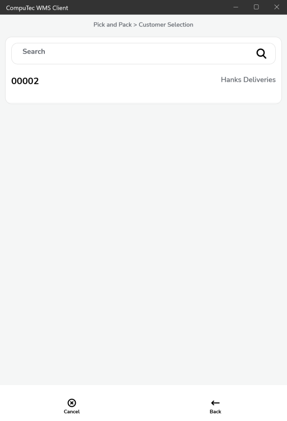

# Pick & Pack

## Support of Storage Units

1. New Storage Units
2. Existing Storage Units (support only for Storage Units that have the same Items that are on the Pick List)

A top bar was added – for displaying an Storage Unit that is now in packing mode.

The change is related to the Pick List from the following documents:

1. Sales Order
2. Production Orders
3. Reserve Invoices
4. Inventory Transfer Requests

Support for both preallocation and without it (Custom Configuration: it is possible to block picking from different than assigned).

## List Display

The list will be displayed based on Custom Configuration settings

1. Standard (all Pick Lists).

    
2. Customer – Date

    
3. Date – Customer

    

    

## Document Details

:::caution
    All the data is automatically saved during the picking
:::

Buttons:

- Cancel – going back to the main menu.
- More – a dropdown list
- Info – base document header remarks.
- Accept – finishing a Pick List (no the floppy disk button anymore)
- Add Storage Unit – adding a Storage Unit

    1. New Storage Unit
    2. Existing Storage Unit
- Back – going back to the document list.

:::info
    Using Pick List supported.

    Pick List – visible for all selected users:

    Custom Configuration option:

    1. if the picker field is filled, then the pick list is visible only for this picker.

    2. if the picker field is empty in SAP B1, the pick list is visible for everyone + the CC setting.

    The picker is saved, and now only this picker can picker can continue the Pick List.
    Or the picker field stays blank.
:::

Manual and scanning quantity picking stays the same.

## A significant change

Each Item from now on will have a separate line for localization. The same way it is in SAP Business One.

Without preallocation (the bold font for the proposed location, sorted for the picker).

With preallocation (the list sorted for the picker).

Sorting Items by the closest location added (for speeding up the pick and pack process).

## 1. New Storage Unit

Choosing a new Storage Unit leads to the form.

Buttons:

- Back – canceling an Storage Unit – it should be Cancel
- Select all – checking a target Warehouse/Bin for an Storage Unit
- Forward – Document Details creation of an Storage Unit and move to the Document Details form
- Attachment – move to the UDF for the Storage Unit form

After SU is created, its number is displayed in the top bar. It means that the Item collection for this Storage Unit is active.

Clicking the top bar leads to an Storage Unit.

To choose the Storage Unit again, you can scan a code (e.g., Storage Unit Code) or select the Storage Unit manually from the list.

Buttons:

- Return – Document Details return to the Document Details form
- Search Storage Unit – an Storage Unit again (it will be displayed in the top bar)
- Storage Unit Info – Storage Unit information
- Back – go back to the Document Details form
- Remove – removing from the Storage Unit list.

When the Storage Unit is chosen, clicking the line again opens a form.

Items available in the Storage Unit are displayed here. You can also edit them from here.

Buttons:

- Return – go back to the Document Details form
- SU Warehouse – change the target location for the Storage Unit
- SU Info – Storage Unit information
- Back – go back to the Document Details form
- Remove – remove from the SU list

Editing Quantity is possible directly from the Item line level and by entering a line in the Storage Unit.

Editing quantity in SU does not require SU to be loaded in the top bar. You can do in from this level.

## 2. Existing Storage Unit

Buttons:

Return, Back – go back to the document Details form

In the case of Existing Storage Unit, choosing an Storage Unit with the same Items as in the Pick List will be possible

## 3. Pre-allocation

### Scenario 1: When pre-allocation is not used

1. None Items

    
    
    
2. Batch Items

    
    
    
    
3. Serial Items

    
    
    

### Scenario 2:  When pre-allocation is used

1. None Items

    
    
2. Batch Items

    
    
3. Serial Items

    
    

## 4. Scanning Management

## 5. Custom Configuration

1. Hide the Storage Unit button.
2. Picking Items only by scanning.
3. Quantity must be confirmed by clicking a button.

## 6. Changes

1. Document Details
Items displayed the way they are on the Pick List, not like on the Sales Order. (On Sales Order, there can be one line, but if it is going to be taken from two locations, then on the Pick List, it will be split into two lines)

    
2. Locations also will be available in the list.
3. A possibility to scan:

    1. Item Code, Barcode, Batch / Serial Number, Item + Batch / Serial Numbers,\
    2. Storage Unit/SSCC:

        - new (not assigned to any of the locations)
        - existing, containing only Items from the Pick List
        - existing, containing only Items and Batches / Serial Numbers, locations from Pick Lists (if allocated before in SAP Business One).
    3. Location.

        After scanning a location, only Items with quantity picked from this location are displayed (or just present in this location if they were not assigned).
    4. Adding Storage Unit.
