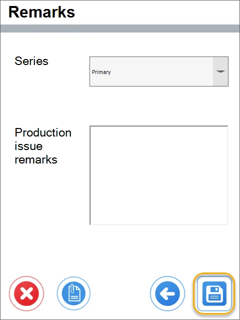

# From Pick Order

The Pick Order transaction allows generating a ProcessForce Production issue from a Pick Order. (An example Pick Order used in this guide is posted below).

:::note
    Some forms' order and availability during a document's creation may vary depending on individual settings. Click here to find out more.
:::

1. To create a Production Issue from a Pick Order, click Pick Order in the main menu.

    
2. The Opened Pick Orders window will appear.

    Choose a desired Pick Order by clicking its row. Only opened or started Pick Orders are displayed.

    

    :::caution
        You can use the Filter field to search the records by typing in at least a part of a name or a document number.

        It is also possible to search by document date. In this case, a date without separators has to be typed in the filter field, e.g., 20190107 instead of 2019-01-07.
    :::

3. The Items to Pick order form will appear with Manufacturing Orders connected to the chosen Pick Order.

    Click an Item row or scan a barcode with an Item prefix to choose it from the list and set its quantity.

    

    

    Click the '+' button to add Manufacturing Orders not connected to the chosen Pick Order.

    

    You can also add a Manufacturing Order by scanning a barcode with a document number prefix. Only Manufacturing Orders with the status Open can be added.

    Click a required row or scan a barcode with a document number prefix to add a Manufacturing Order to the Items to Pick List.

    

    Click the Storage Unit icon to add a Storage Unit to a current document. You can add a Storage Unit by scanning a barcode with an SU prefix. Only SUs with Items from the related Pick Order and the same Warehouse as on the Items rows can be added.

    

    Click the required Storage Unit row to add it to the document. You can add it by scanning a barcode with a storage unit prefix.

    

    

    Scanning a barcode without a prefix in the Items to pick list, which resulted in checking it for storage unit information.

    
4. Choosing a Storage Unit or a Batch in the FIFO method is possible. You can skip this step by clicking the 'Right Arrow' icon.

    You can hide this form by using the option.

    

    

    
5. If an Item is managed by Bin Locations, the From Bin form will appear.

    Click a desired Bin row to choose it. You can also scan a barcode (with prefixes or not).

    
6. If Batches manages an Item, the Batch form will appear.

    Click the desired Batch row. A batch can be chosen by scanning a barcode with a prefix.

    
7. The Quantity form will appear.

    The field is automatically filled in with the required quantity. Type in the desired amount or set it by clicking the plus and minus buttons.

    Quantity can be set by scanning a barcode with a quantity prefix. Click the right arrow after selecting an amount.

    
8. In the Items to pick form, click the 'Right Arrow' button after setting the required quantities for each Item.

    
9. Remarks form will appear.

    Issue document numbering series can be chosen from the drop-down lists. This value can be preset in ProcessForce form Document Numbering: Main Menu > Administration > System Initialization> Document Numbering. If the series is not picked, the default ones will be selected.

    Remarks can be added.

    <!--  -->

10. Click the Save icon after setting all the details.

    
11. A system message about a document creation will be displayed.

    Click 'OK' to finish the creation of a document.

    
12. Goods Issue has been created and recorded and can be viewed in SAP Business One.
