# New Production Issue

The Pick Order transaction allows generating a ProcessForce Production Issue.

:::note
    The order and availability of some of the forms during a document's creation may vary depending on individual settings. Click here to find out more.
:::

1. To create a Production Issue from a Pick Order, click Pick Order in the main menu.

    

    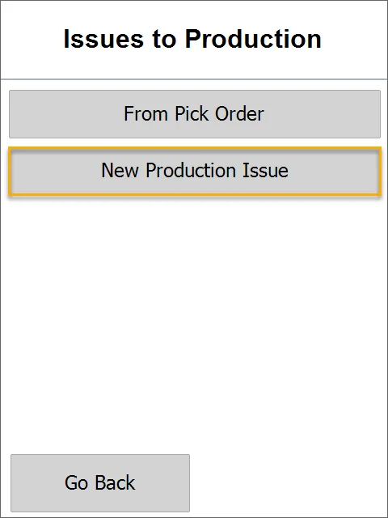
2. The Opened Pick Orders window will appear.

    Choose a desired Pick Order by clicking its row. Only opened or started Manufacturing Orders are displayed.

    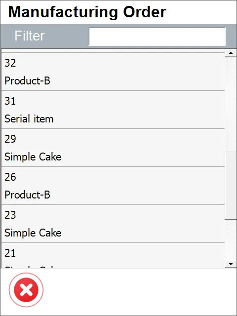

    :::warning
        You can use the Filter field to search the records by typing in at least a part of a name or a document number.

        It is also possible to search by document date. In this case, a date without separators has to be typed in the filter field, e.g., 20190107 instead of 2019-01-07.
    :::
3. The 'Items to pick order' form will appear with Manufacturing Orders connected to the chosen Pick Order.

    Click an Item row or scan a barcode with an Item prefix to choose it from the list and set its quantity.

    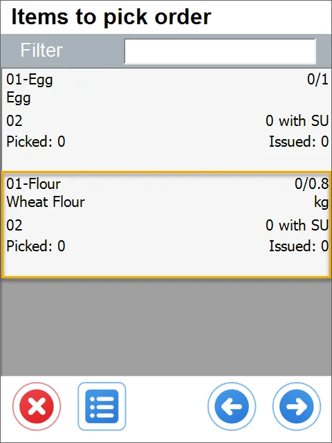

    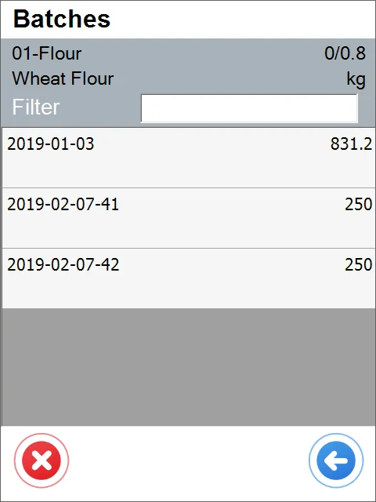

    The required quantity is automatically entered in the quantity field.

    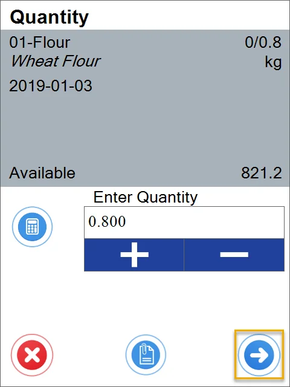

    Click the '+' icon to add Manufacturing Orders not connected to the chosen Pick Order.

    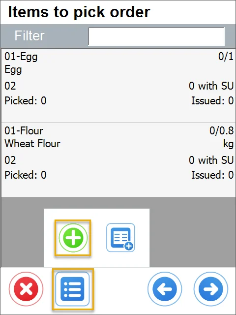

    You can also add a Manufacturing Order by scanning a barcode with a document number prefix. Only Manufacturing Orders with the status Open can be added.

    Click a required row or scan a barcode with a document number prefix to add a Manufacturing Order to the Items to Pick list.

    

    Click the Storage Unit icon to add an SU to a current document. You can add an SU by scanning a barcode with an SU prefix. Only SU with Items from Pick Order and the same Warehouse as on the Items rows can be added.

    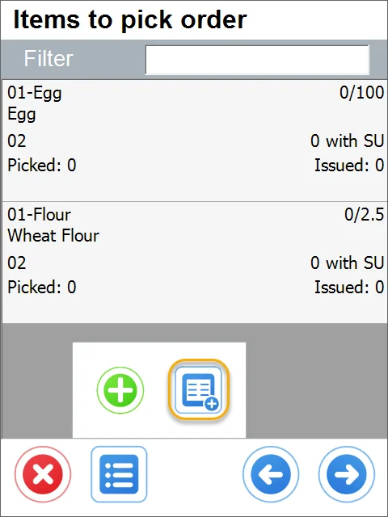

    Click a required SU row to add it to the document. You can add it by scanning a barcode with an SU prefix.

    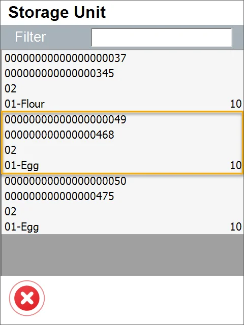

    

    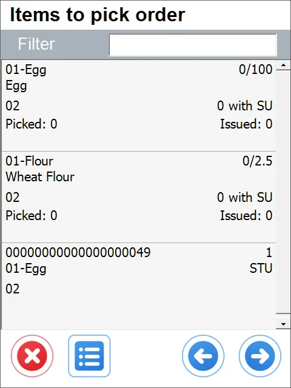

    Scanning a barcode without a prefix in the Items to Pick list results in checking it for storage unit information.
4. Choosing a Storage Unit or a Batch in the FIFO method is possible. You can skip this step by clicking the right arrow icon.

    You can hide this form by using [the related Custom Configuration](../../../administrator-guide/custom-configuration/overview.md) option.

    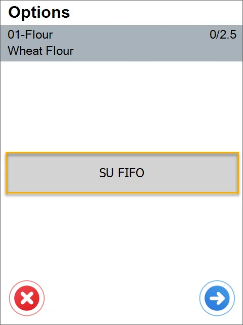

    

    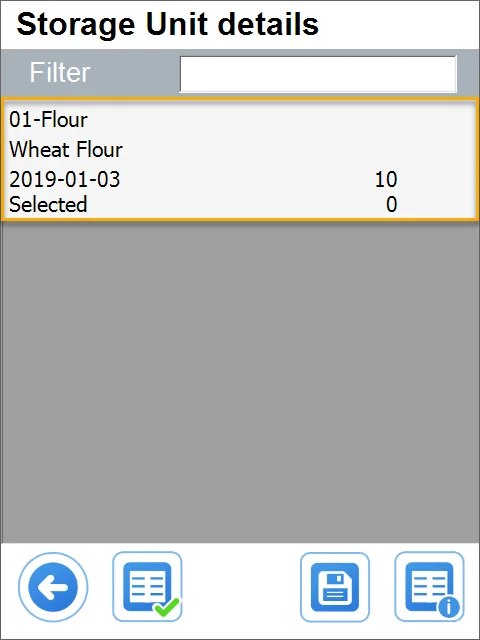
5. If the Item is managed by Bin Locations, the 'From Bin' form will appear.

    Click a desired Bin row to choose it. You can also scan a barcode (with prefixes or not).

    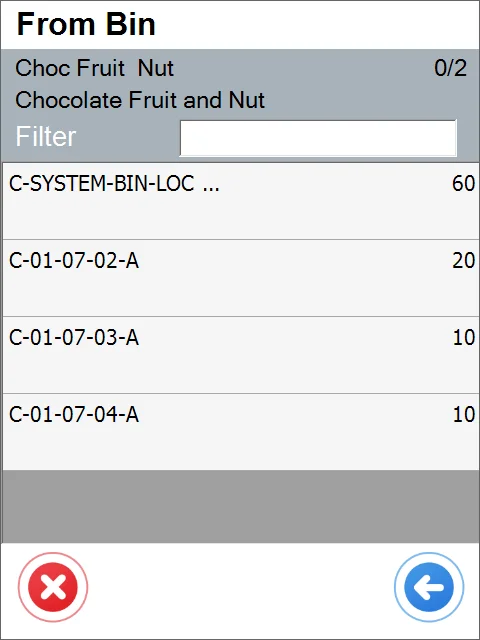
6. If the Item is managed by Batches, the Batch form will appear.

    Click the desired Batch row. A batch can be chosen by scanning a barcode with a prefix.

    
7. The Quantity form will appear.

    The field is automatically filled in with the required quantity. Type in the desired quantity or set it by clicking the plus and minus buttons.

    Quantity can be set by scanning a barcode with a quantity prefix. Click the 'Right Arrow' icon after selecting the quantity.

    
8. In the 'Items to pick order' form, click the 'Right Arrow' button after setting the required quantities for every item.

    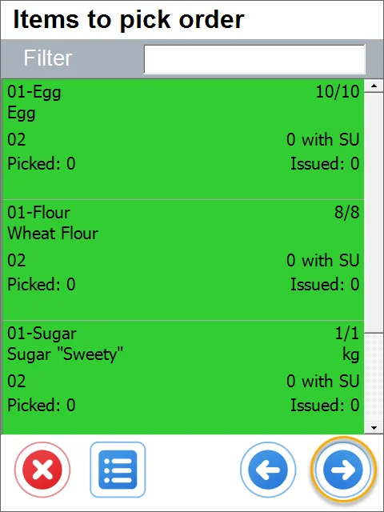
9. Remarks form will appear.

    Issue series can be chosen from the drop-down list. This value can be preset in ProcessForce form Document Numbering: Main Menu > Administration > System Initialization > Document Numbering. If the series is not picked, the default ones will be selected.

    Remarks can be added.

    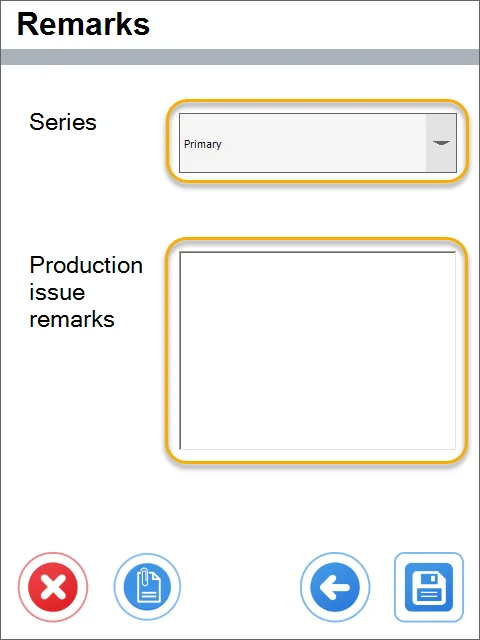
10. Click the Save icon after setting all the details.

    
11. A message about a document creation will be displayed.

    Click 'OK' to finish the creation of a document.

    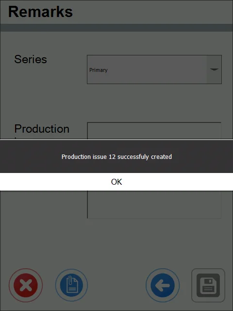
12. Goods Issue has been created and recorded and can be viewed in SAP Business One.
