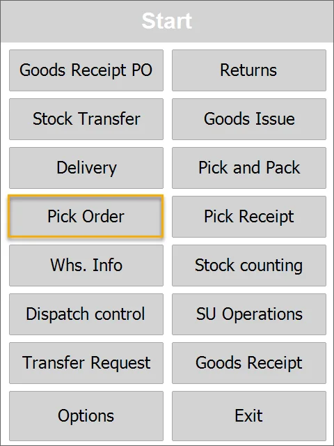
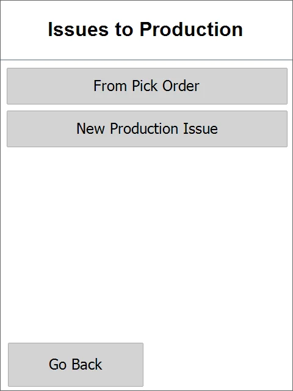
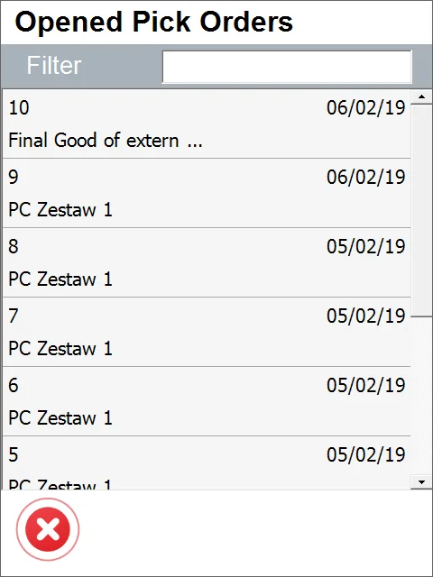
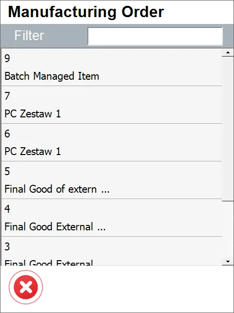
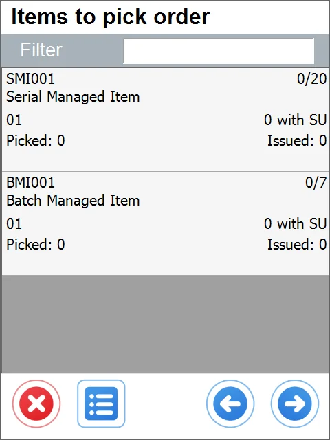
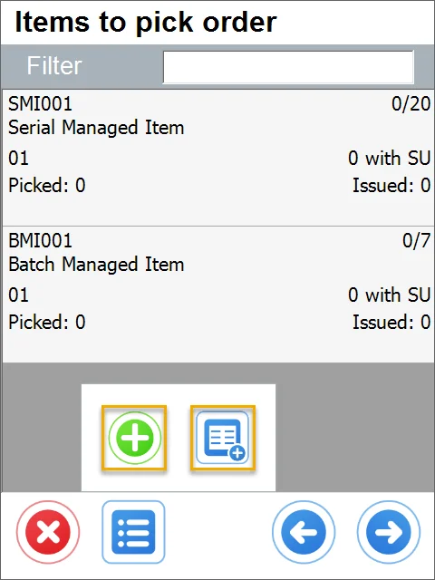
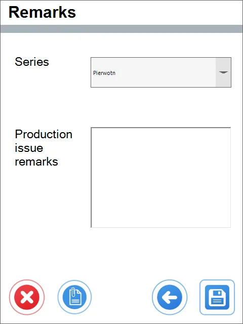
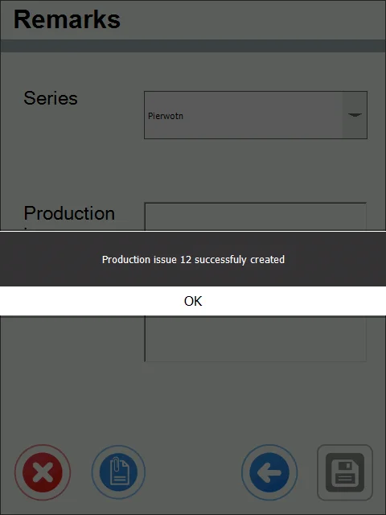
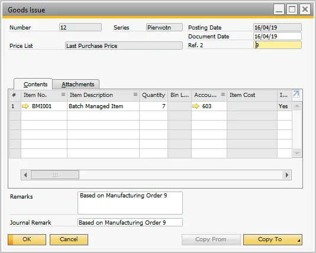

# Overview

:::info
    The Pick Order transaction allows generating a ProcessForce Production Issue.
:::

1. To create a Production Issue from a Pick Order, click Pick Order in the main menu.

    
2. You can select From Pick Order or New Production Issue.

    
3. Select from Pick Orders or Manufacturing Orders.

    You can use Filter to search for specific orders you want to issue to production.

    

    
4. The list of Items for Pick Order is opened.

    
5. Add items from another Pick Order, Manufacturing Order, or Storage Unit.

    
6. After adding the required Items and their quantities, click the 'Right Arrow" icon to go to the Remarks form

    
7. You can add some remarks, change the series, add UDFs, or just save and post the document.

    
8. The Production Issue is posted in SAP Business One.

    

## ProcessForce option for Auto Allocation Serial Numbers and Batches (with bin locations)

Since ProcessForce PL11, users can choose how to _Auto Allocate Batches on the Pick Order_ option:

This setting is responsible for whether to display or not preselected on Pick Order, Batches/Serial Numbers (there is no unique option for Serial Numbers; the same setting affects both Serial Numbers and Batches).
In WMS, Batches/Serial Numbers preallocated on other documents are always omitted; thus, the "On other documents" option will not affect WMS. Suppose a user wants to consider preselected Batches and Serial Numbers on every document in WMS. In that case, one must select either "Allocated" or "Both" to recalculate quantities properly.

Moreover, the quantities will be recalculated for the same Pick Order - this option does not work like preallocation on Pick Lists.
This means that if on an original Pick Order document, there were seven serial numbers to be picked and five were already preselected in SAP B1, then in WMS, there will be only two more serials left to choose and the five previously selected won't be displayed in Serial Selection window.

With the SAP B1 PF setting enabled, preselecting batches or serials on Pick Order will affect all other transactions in WMS, i.e., if a specific serial, for example, S0001, is preselected on a pick order in SAP B1, then the same serial S0001 won't be available for example on the Delivery transaction.

The preselected quantities will also be considered when displaying available quantities in bin locations.
