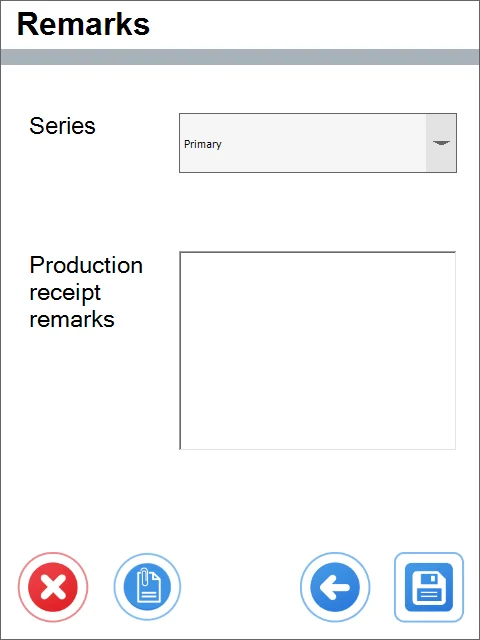

# From All Pick Receipts

1. Choose From the All Pick Receipts option.

    
2. This leads to the list of Items to be received.

    
3. Click one of the Item rows to go to the Options window. Here, you can choose a Storage Unit to create a new one. Click the right arrow icon to skip the SU options and set the quantity.

    
4. After choosing Continue SU, you can set the quantity:

    
5. It is possible to set additional information on the SU:

    
6. If the Item is managed by Batches, clicking it leads to the Batch window in which it is possible to choose a Batch and quantity:

    
7. Remarks window: you can add Remarks, change numbering Series, or put values to User-Defined Fields.

    
