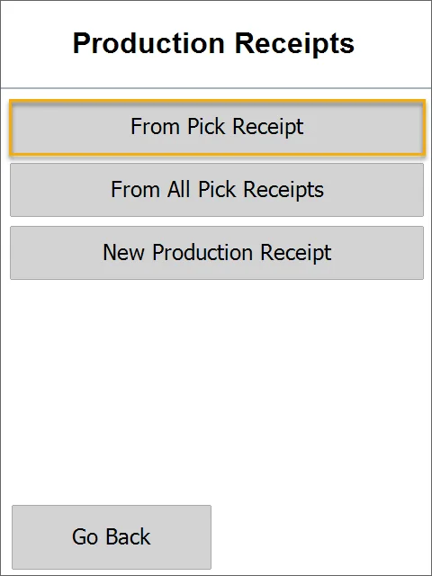
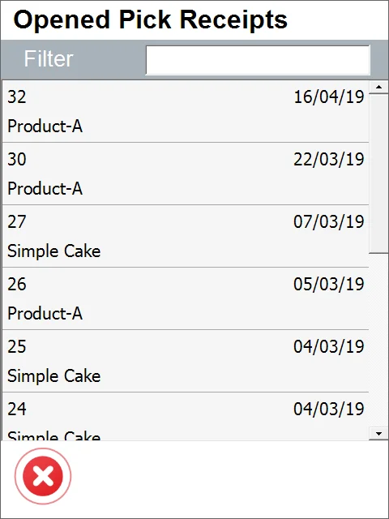
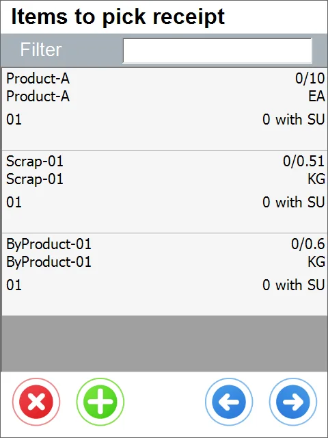
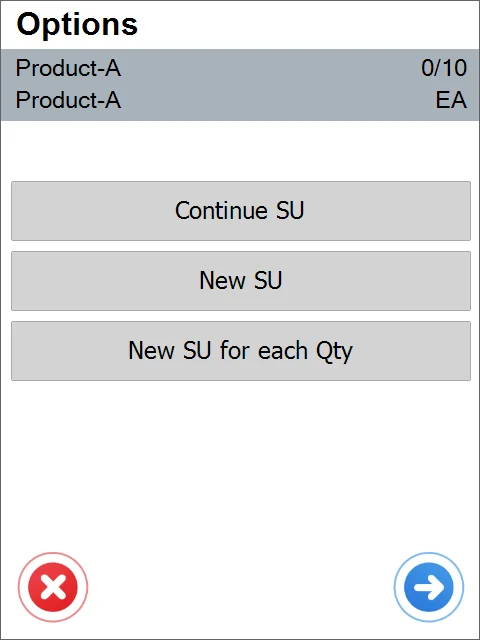
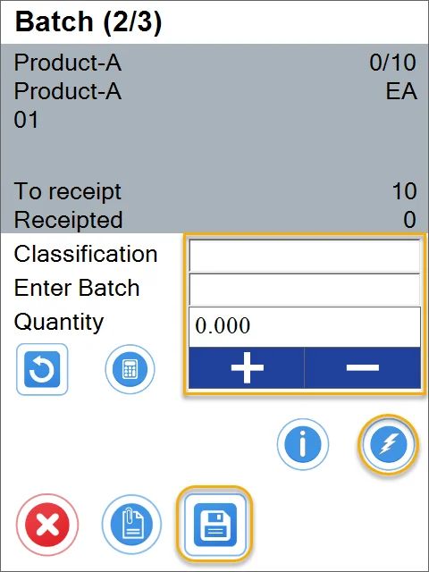
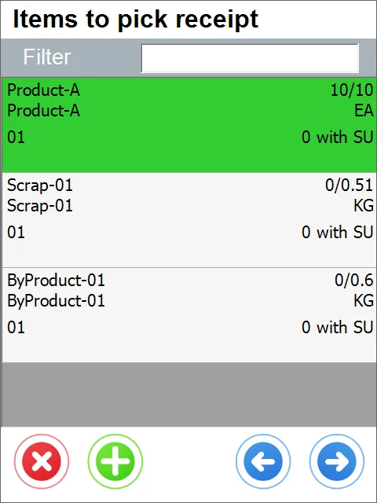
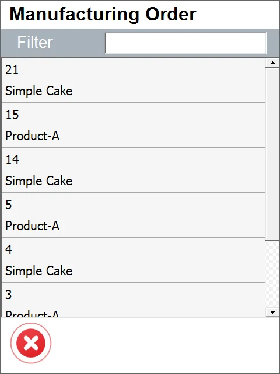
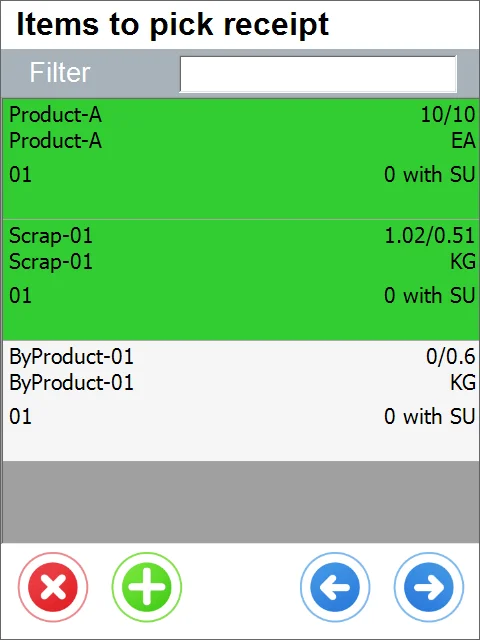
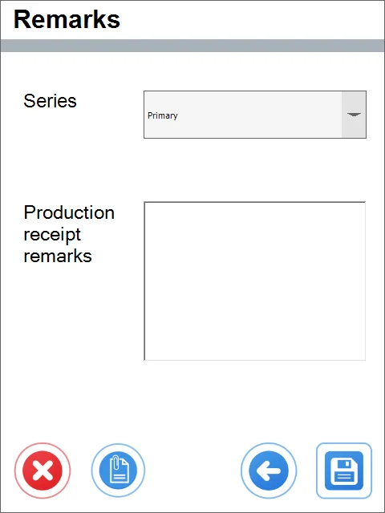

# From Pick Receipt

1. Choose From Pick Receipt.

    
2. Choose a document from the Opened Pick Receipt list.

    
3. Click an Item row to choose it and set its quantity.

    
4. You can choose a Storage Unit or select it from the list. Click the right arrow icon to move to the next step without Storage Units.

    
5. Type in Classification (if applicable) and Batch number (you can generate a Batch number by clicking the 'Lightning' icon). Click the 'Save' icon to save the changes.

    
6. This leads to the 'Items to pick receipt' form.

    
7. You can click the '+' icon to add Items from another Manufacturing Order. A list of Manufacturing Order will appear. Choose one to add and set the quantity.

    
8. After choosing the required Items and setting their quantity, click the 'Right Arrow' icon.

    
9. This leads to the Remarks form. You can set values for User Defined Fields - click the second left icon to do this.

    
10. You can click the 'Left Arrow' icon to go back and change the transaction details, choose Numbering Series (if applies), put remarks, or click the 'Save' icon to save all the changes

    
