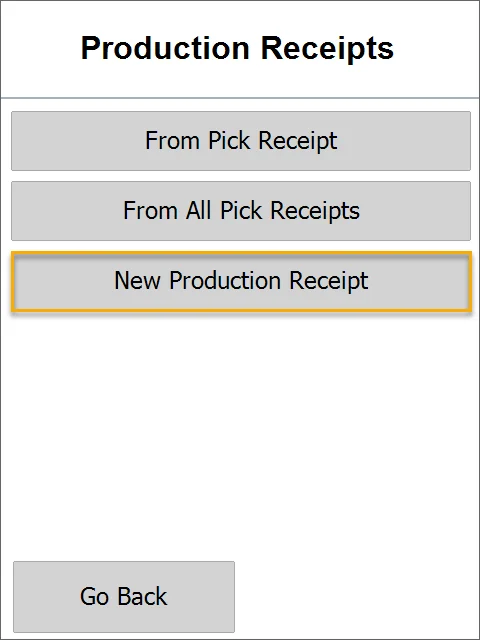
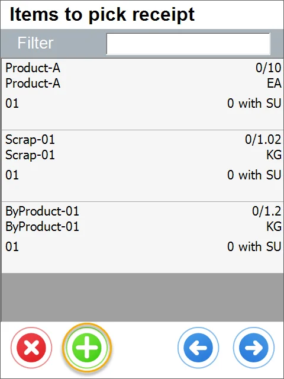
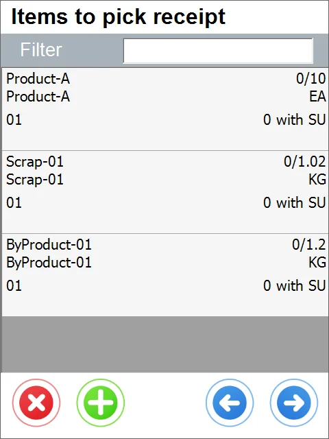
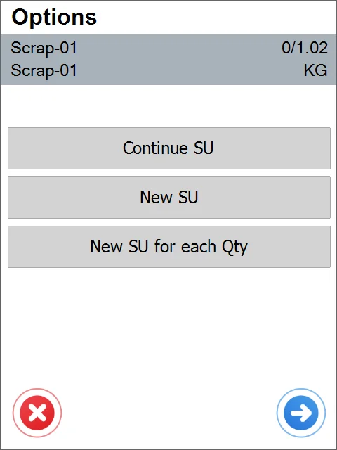
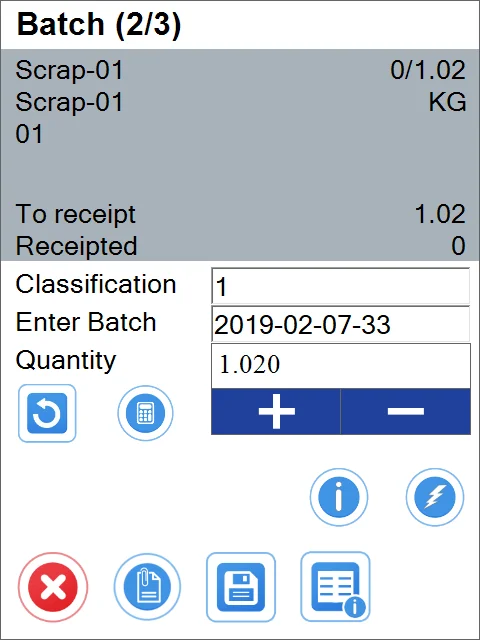
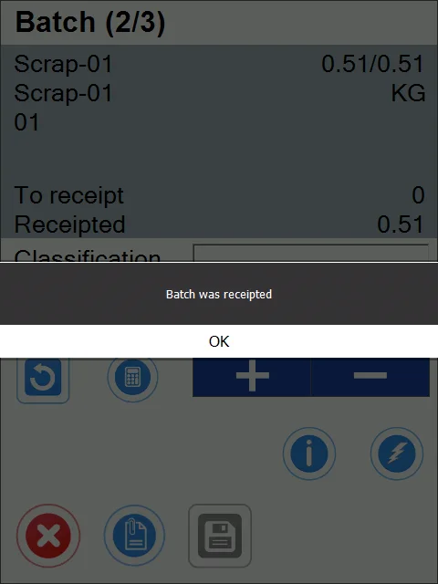
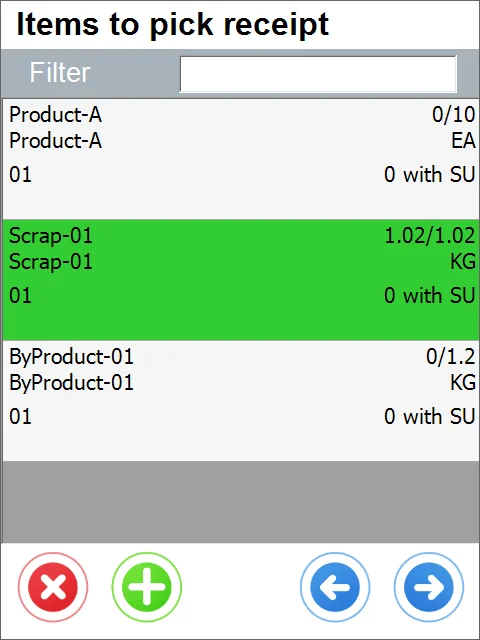

# New Production Receipt

1. Choose a New Production Receipt.

    
2. Choose a Manufacturing Order from the list.

    
3. If the related Custom Configuration option is checked, you can choose an Employee.

4. You can add Items from other Manufacturing Orders to the list by clicking the '+' icon.

    
5. After clicking the icon, the list of Manufacturing Orders appears. You can choose one of the Manufacturing Orders.

    
6. Click an Item's line to set its quantity.

    
7. ItemsToPickReceipt.webp

    This leads to the SU options form:

    
8. You can create a new Storage Unit, add an existing one, or set the quantity. To do this, click the 'Right Arrow' icon. Set quantity, Batch number, and Classification. You can also save additional information. Click the 'Save' icon to save the information and go to the Items form.
    
9. After setting the quantity that equals the To pick quantity and clicking the save icon, you get a system message about the Batch being receipted.

    
10. Clicking the red icon leads back to the Items list. A line of an Item for which the total quantity was picked is highlighted in green.

    
11. Click the 'Right Arrow' icon after completing picking to go to the Remarks form. You can set Document Numbering series, remarks, or dd a User-Defined Field. The document is saved upon clicking the 'Save' icon.
