# SAP Production Issue

An SAP Production Issue in CompuTec WMS can be generated from Production Orders posted in the SAP Business One system. (An example Production Order used in this guide is posted below).

:::info
    The order and availability of some of the forms during a document's creation may vary depending on individual settings. Click here to find out more.
:::

1. To create an SAP production issue, click SAP Production Issue in the main menu:

    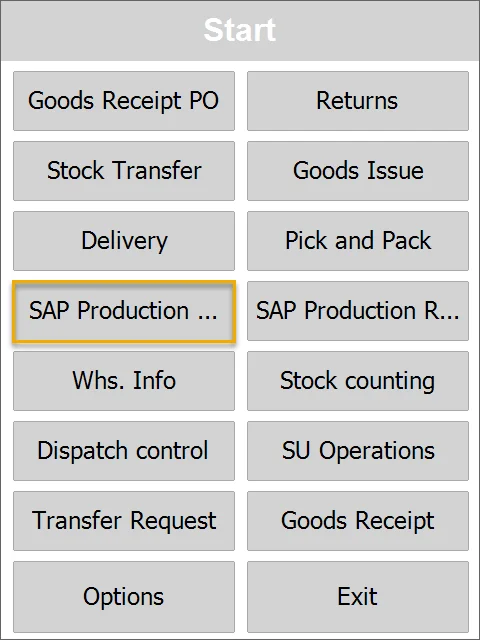
2. The Source Warehouse selection window will appear:

    Choose the desired Warehouse by clicking its row.

    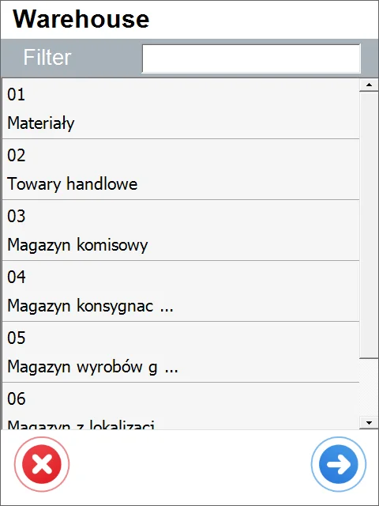
3. The Production Orders window will appear with a list of Production Orders.

    If a Warehouse was chosen in the previous step, only Production Orders connected to this Warehouse appear. Choose at least one of the Orders. A blue highlight and a green icon will show the selection. Click the right arrow icon after selecting the Orders.

    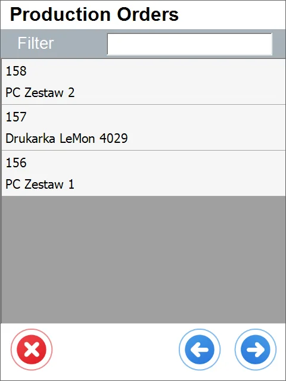
4. The Document Details window will appear.

    Only the Items with a manual issue method assigned will appear. Click an Item to set its details.

    If an Item row is colored red, it means there are no Items in the selected warehouse.

    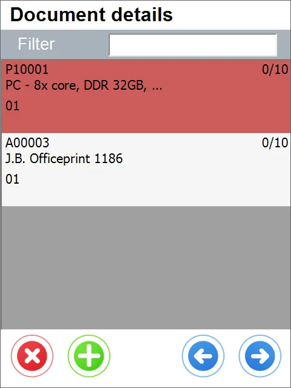
5. If the chosen Warehouse has Bin Locations, the Bin selection window will appear while determining the document details.

    Click a Bin row to choose the desired Bin location.

    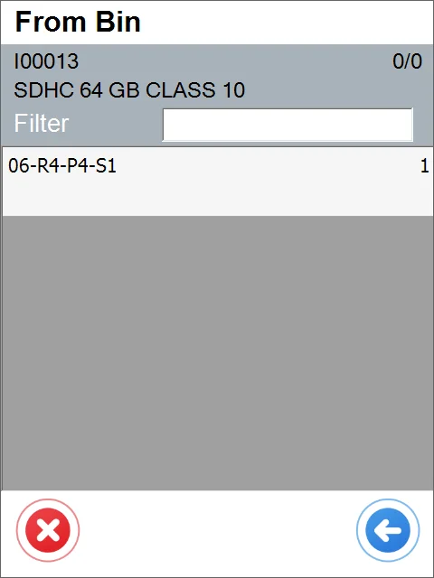
6. The Quantity Window will appear.

    You can change the quantity by typing it in or using the '+' and '-' icon buttons. Click the right arrow icon after choosing the correct quantity to return to the Document Details window.

    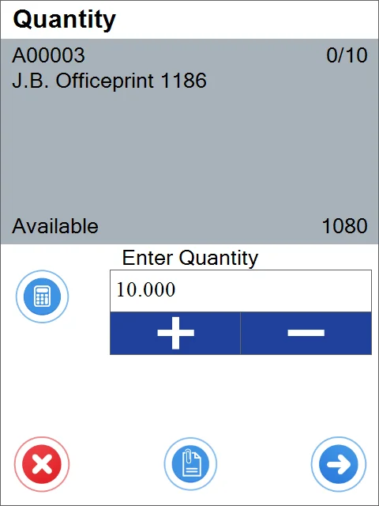
7. If Serial Numbers manage the Item, the Serial Number window appears after step 5 of this guide.

    Clicking a Serial Number row picks it and adds it to the Document Details window. This step should be repeated until obtaining the desired quantity.

    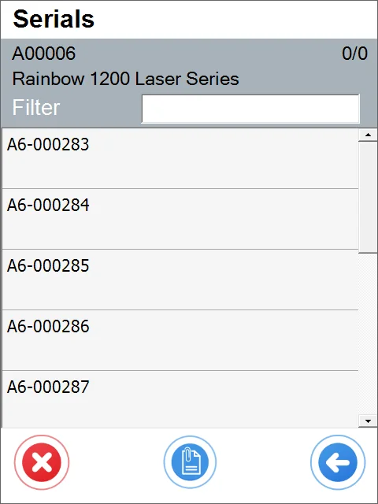
8. If Batches manages the Item, the Batch window will appear after clicking the Item in the Document Details window.

    The Quantity window appears after clicking the desired batch (see no. 6 of this guide).

    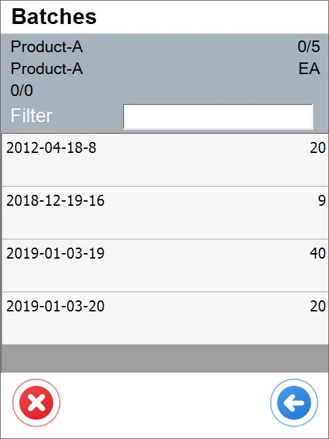
9. Click the right arrow icon after setting document details.

    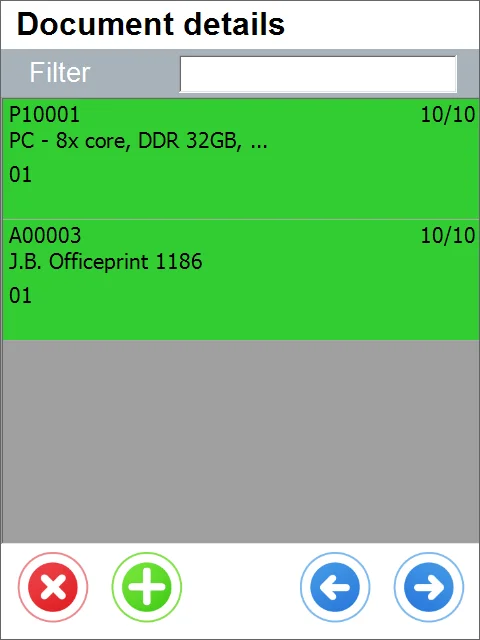
10. The Remarks window will appear.

    Filling in a reference number field and a Production issue remarks field is optional.

    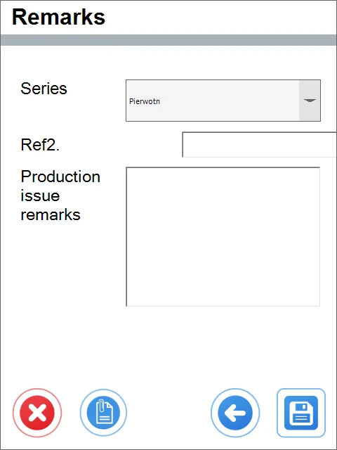
11. Click the save icon to generate the SAP Production Issue document.

    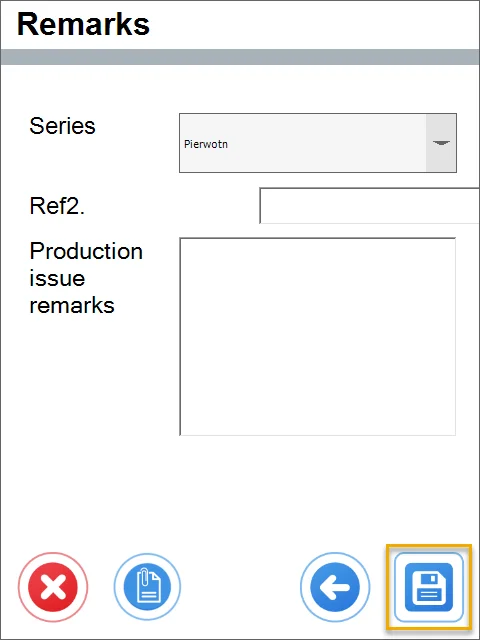
12. A note about the creation of the document is displayed. Click "OK" to finish the transaction.

    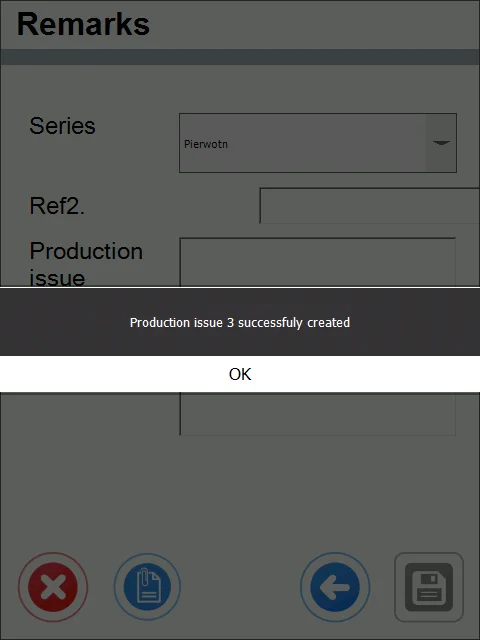
13. The SAP Production Issue is posted and is available in SAP Business One.
