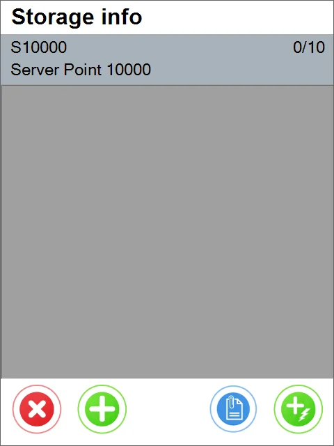

# SAP Production Receipt

:::info
    The SAP Production Issue function is unavailable if ProcessForce is installed on a database that CompuTec WMS operates on.
:::

To create an SAP Production Receipt, click SAP Production Receipt in the main menu:

The Production Orders window will appear:

When you select one of the Production Orders, the document details screen opens:

Click the selected Item to open the Storage info screen:

The Storage Info window will appear. At this moment, we can add an Item or generate a Serial Number for an item:

Let's see how to manually add the Serial Number for the Item. (click the green button "1")

Serial Numbers can be generated or set manually.

Click the save button after adding the Serial Number:

Then click the green confirmation button.

Let's see how to generate Serial Numbers for items. (click the green button "2"):

In the field 'No. of Create,' we can enter a number of Serial Numbers to be generated:

Serial Numbers for Items were generated successfully. Click the right arrow button:

You can add remarks. Click the save button to save the receipt document:

A note about the creation of a document is displayed. Click 'OK' to finish the transaction:

