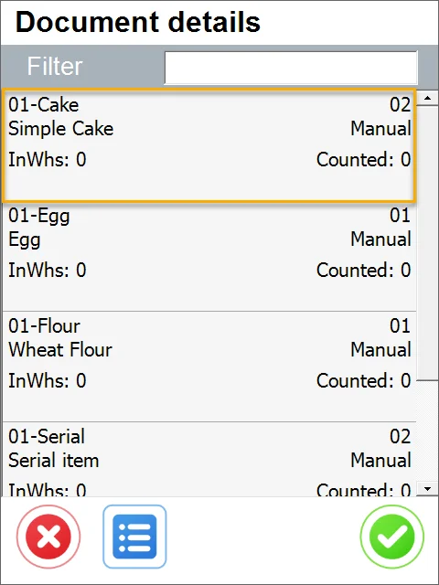
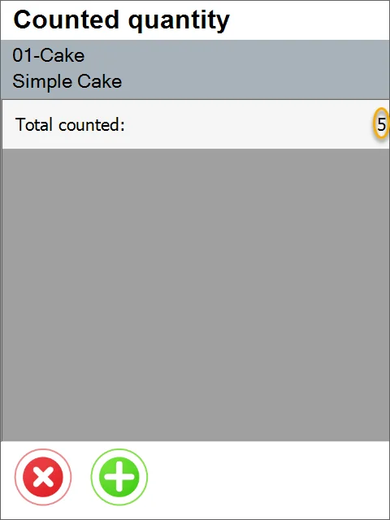

# Stock Counting

Stock Counting is checking the quantity of Items available in a specific Warehouse. CompuTec WMS supports the SAP Business One Stock Counting function.

:::warning
    Note that currently, CompuTec WMS supports only Stock Counting documents with Stock Counter set to User.
:::

1. Choose the Stock Counting option from the main menu:

    
2. Choose the required document:

    
3. Items available on the document are displayed.

    The following data are displayed on the Item row: Item Name, Item Code, Bin, quantity in a Warehouse, and counted quantity.

    Click an Item row to set up its details.

    
4. If batches or serials do not manage the Item, choosing it leads to the Counted quantity form with the Total counted quantity:

    

    Click the Total Counted row or Plus icon to set up the quantity. Set it up by clicking '+' and '-' icons or by typing it in:

    

    Click the Save icon after setting up the quantity. Total counted will change:

    

    Click the 'x' icon to go back to the Items list.

    
5. If Serial Numbers manage the Item, choosing it leads to the Serials form. Click the '+' icon to add an Item with a Serial Number.

    

    Enter a Serial Number and click the Save icon:

    

    The Item is counted and added to the list:

    

    Click the 'x' icon to go back to the Items list.
6. If the Item is managed by Batches, choosing it leads to the Batches form. Click the '+' icon to set up quantity:

    

    Enter the Batch number, set up the quantity by typing it in or by using the + or - icons, and click the Save icon:

    

    Quantity with a specified Batch is added to the document:

    

    Click the 'x' icon to return to the list of Items.
7. You can add a new Item to the list by clicking the menu icon and then the '+' icon.

    

8. You can add a Storage Unit by clicking the menu icon and the highlighted icon:

    

    Scan an SU barcode or enter a number and click Search or SSCC Search (depending on the type of the entered number).

    All the Items from the chosen SU will be added to the Item list.

    
9. You can check already added SUs by clicking the menu icon and then the highlighted icon:

    

    
10. Unlike most of the CompuTec WMS transactions, you do not save the document after completing work. Values are being saved at the moment of adding quantity. Click the 'x' icon to go back to the main menu:

    
