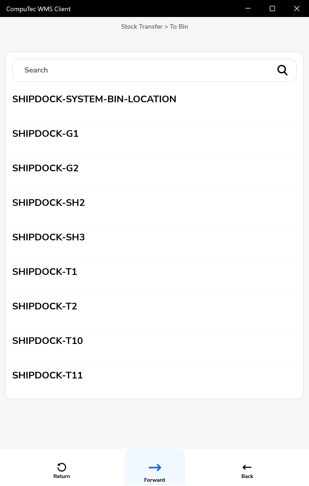

# Stock Transfer from Pick List

## Generate warehouse transfer from pick list

1. We create pickings from the WMS > Pick and Pack level and proceed to the Stock Transfer transaction

    
    

2. We choose the pick list

    

3. In the next step, we can proceed to selecting the target warehouse

    
    
    
    

4. In the put items window we can define the location for each item

    

5. In the last step, saves the document

    
