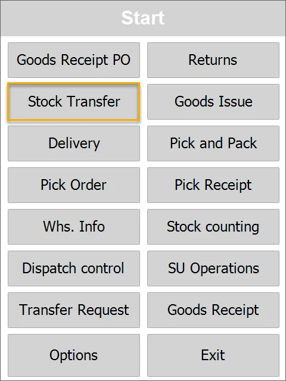
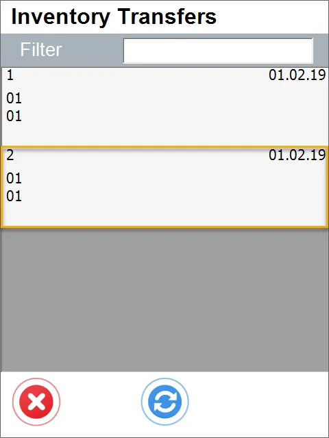

# From Transfer Request

1. Choose Stock Transfer in the main menu to create a Stock Transfer from Transfer Request.

2.  Choose the transaction type - a new document or based on an Inventory Transfer Request.

3. The Stock Transfer Requests window appears.

Choose Inventory Transfer Request by clicking its row. If a Warehouse was chosen in an **Application Settings**, only Inventory Transfer Requests from this Warehouse are displayed. Scanning an Item code filters Inventory Transfer Requests that contain this Item.

This form will not be displayed if no Inventory Transfer Requests are assigned to the chosen Warehouse.

4. The Document details window appears.

In this case, an Inventory Transfer Request was created for two Items. The following information is displayed:

    - Item Code

    - Item Name

    - Source Warehouse code

    - Already picked / Target Quantity (0/20 in this example)

    - Unit of Measurement

    - Quantity contained in any Storage Unit.

Click an Item to set up its details.

5. Set up quantity for the chosen Item.

After clicking an Item row, it is possible to choose Batch/Serial Numbers (if the Item is managed by these) and quantity.

6. The options window will be displayed.

You can pick a Storage Unit in a FIFO manner or skip this step.

7. A: The Quantity window will appear. You can change the quantity by typing it in or using the '+' and '-' buttons.

7. B: The Storage Unit window will open. Here, you can check SUs containing the chosen Item.

8. Adding new Item.

:::warning

You can add items or Storage Units not connected to transfer requests by clicking the right icon and the Item (1) or Storage Unit (2) icon later.

:::

8. A. Clicking the '+' icon (1) leads to the New Item form. Click the required Item or scan an Item code to add the item to the list.

8. B. Storage Unit.

Clicking the second icon (2) leads to the Storage Unit form. Click the required SU.

Clicking a required storage unit or scanning its bar code adds it to the list.

Clicking the Storage Unit icon leads to the Storage Unit form.

Note that a row with SU info has been added, not rows of Items.

Info on an SU row:

    - an SU number

    - a name of the first Item on SU

    - quantity of SUs

    - Unit of Measurement: in this case, it is STU (Storage Unit).

After completing a Stock Transfer, an Inventory Register entry is created in SAP Business One, recording the usage of a specific SU.

Apart from Item data (name, code, picked/required quantity, Batch – if managed by Batches, Serial Number – if managed by Serials), info about quantity is displayed:

    - quantity available in the chosen location

    - quantity still needed to be picked to fulfill an Inventory Transfer Request

    - quantity already picked.

Click the right arrow icon after choosing the right quantity to go to the Document Details window.

9. If Serial Numbers manage an Item, the Serial Number window will appear with a list of available copies with a serial number.

Click a row to pick an Item (or scan its code) and return to the Document Details window. Repeat this procedure until you obtain the desired number of copies.

10. If batch numbers manage an item, the Batch window appears after clicking a row.

After clicking a row of a Batch (or scanning its code), the Quantity window will appear (see no. 7 of this guide).

11. Click the right arrow icon after setting the document's details.

Note that the row turned green: it happens when the picked quantity is equal to or greater than the quantity on the Inventory Transfer Request.

12. The Put Items window will appear.

Click the Put Items button to set the required quantities for all Items.

After setting document details, click the right arrow icon to put items to chosen locations.

13. The Remarks form will appear. Set Series and optionally Remarks. Click the Save button to save and post the document.

14. A note about the creation of a document is displayed. Click "OK" to finish the transaction.

15. An Inventory Transfer is posted and is available in SAP Business One.
