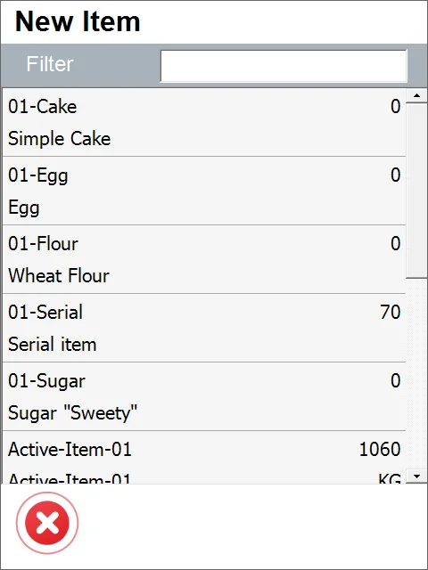
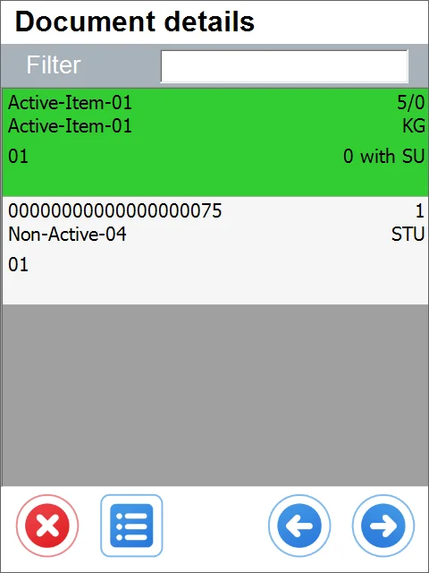

# New Stock Transfer

1. Click the Stock Transfer in the main menu to create a Stock Transfer.

2. Choose the New Inventory Transfer option:

3. The Source Warehouse window will appear.

Choose the desired warehouse. You can choose the filter option to find a desired entry by typing in a part of the Warehouse name or number.

It is possible to set up a default Warehouse. In this case, the Warehouse Selection screen is skipped, leading directly to the Items screen, and the Warehouse set as default is chosen automatically. It is still possible to go to the Warehouse selection form by clicking a left arrow icon on the Items selection screen.

4. The Items window appears

Here, it is possible to add new Items.

a. If a Warehouse was chosen, all the Items with their quantities in the Warehouse will be displayed:

b. If the Warehouse choosing step was skipped, a Source Warehouse has to be selected now and it leads to the New Item window (with Items and their quantities in the Warehouse):

c. If the Warehouse choosing step was skipped, but a default Warehouse is set up, then the New Item window will be displayed with quantities for a specific Warehouse.

5. Quantity.

After choosing an Item, it is required to set up its quantity:

1. Click the required Item's row,

2. Click the Options icon - now it is possible to choose a Storage Unit or to skip this step (by clicking the left arrow icon),

3. Choose a Batch or Serial Number (if needed ),

4. Set up the quantity.

6. Adding new Items or accepting the Stock Transfer.

Adding new Items can be achieved similarly. If the list is complete, click the right arrow icon to go to the Destination Warehouse window.

7. Storage Unit adding.

8. Destination Warehouse.

Here, you can choose a Warehouse to which the selected Items will be moved. The step can be skipped if a default Warehouse has been selected.

9. Putting the Items into the new Warehouse

Click the arrow down icon to put the chosen Items in the destination Warehouse.

10. Remarks

Here, you can choose a document Series and add remarks. It is also possible to fill in a user-defied field (if it has been defined for Stock Transfer, check the next point). Clicking the save icon created a document.

