# Stock Transfer

An Inventory Transfer document in WMS can be generated from manually picked Items or Stock Transfer Requests. (An example Stock Transfer Request used in this guide is posted below).

1. To create a Stock Transfer, press the Stock Transfer in the main menu.

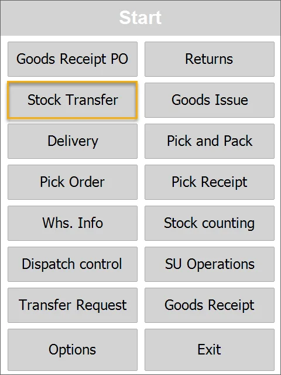

2. Choose the transaction type: new or based on an Inventory Transfer Request document in the system.

3. The Document details window appears.

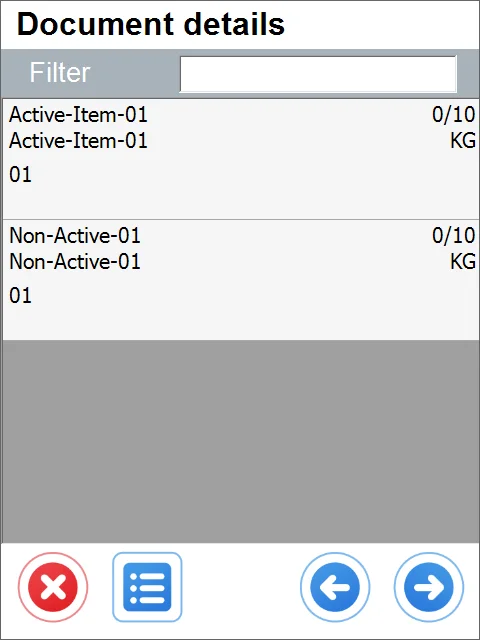

In the example Inventory Transfer Request, we have ten pieces of Active-Item-01. The Item row contains the following details:

    Item Name
    Item Code
    Warehouse number
    quantity without a Storage Unit
    quantity contained in any Storage Unit
    already picked/target quantity (0/10 in this example)
    Unit of Measurement

Click the Item row to set up its details.

:::warning

You can add items or Storage Units not connected to transfer requests by clicking the right icon and the Item (1) or Storage Unit (2) icon later.

:::

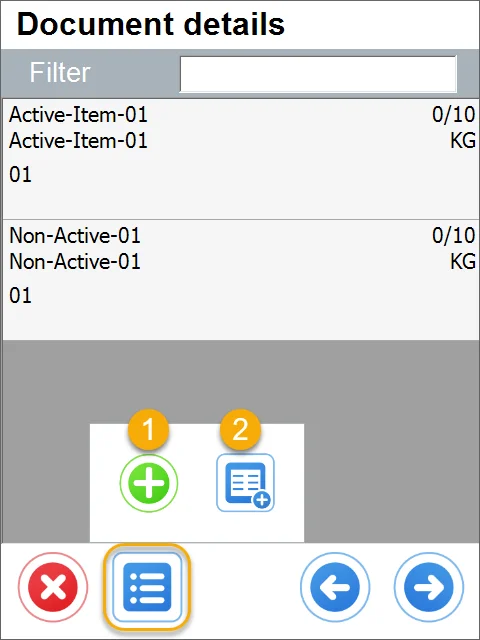

4. Clicking the '+' icon leads to the New Item form. Click the required Item or scan an Item code to add it.

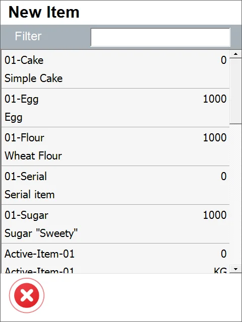

5. Clicking the Storage Unit icon leads to the Storage Unit form. Clicking a required storage unit or scanning its bar code adds it to the list.

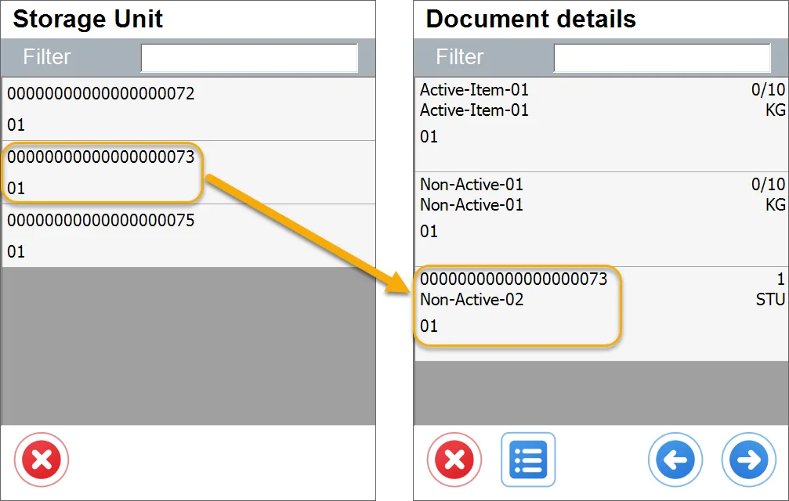

Note that a row with SU info has been added, not rows of Items.

Info on the SU row:

    - an SU number

    - a name of the first Item on SU

    - a number of SUs

    - a Unit of Measurement: in this case, it is STU (Storage Unit).

After completing a Stock Transfer, an Inventory Register entry is created in SAP Business One, recording the usage of a specific SU.

6. Click on the selected Item to select its quantity.

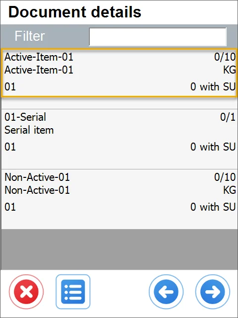

7. The options window will be displayed.

You can pick a (1) Storage Unit in a FIFO manner or (2) skip this step.

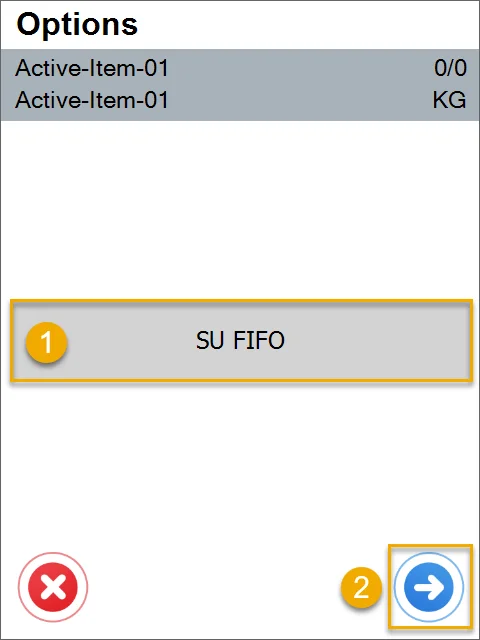

8. The Quantity window will appear. You can change the quantity by typing it in or using the '+' and '-' icon buttons.

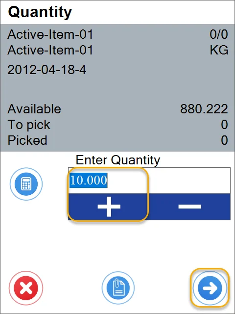

Apart from Item data (name, code, picked/required quantity, Batch – if managed by Batches, Serial Number - if ordered by Serials), info about quantity is displayed:

    - quantity available in the chosen location

    - quantity still needed to be picked to fulfill the Inventory Transfer Request

    - quantity already picked.

Click the right arrow icon after choosing the correct quantity to go to the Document Details window.

9. If Serial Numbers manage an item, the Serial Number window will appear with a list of available copies with a serial number.

Click a row to pick an Item (or scan its code) and return to the Document Details window. Repeat this procedure until you obtain the desired number of copies.

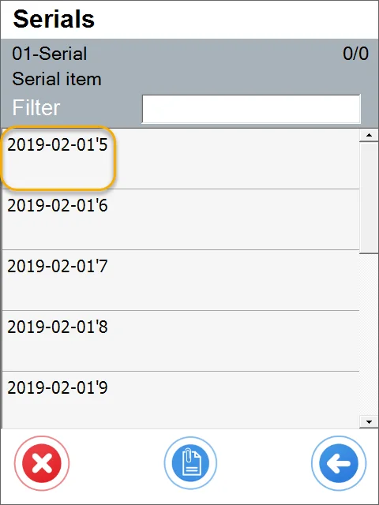

10. If Batch numbers manage an Item, the Batch window appears after clicking a row.

After clicking a row of a Batch (or scanning its code), the Quantity window will appear (see no. 7 of this guide).

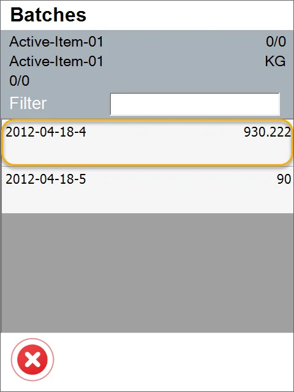

11. Click the right arrow icon after setting the document's details.

Note that the row turned green: it happens when the picked quantity is equal to or greater than the quantity on the Inventory Transfer Request.

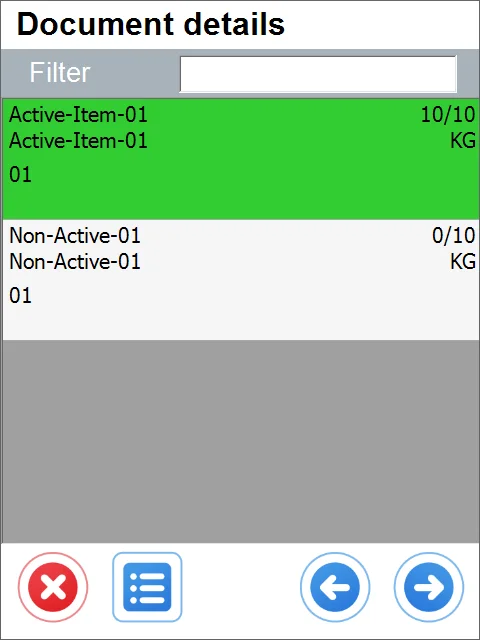

12. The Destination Warehouse window will appear.

Click a Warehouse row to choose it.

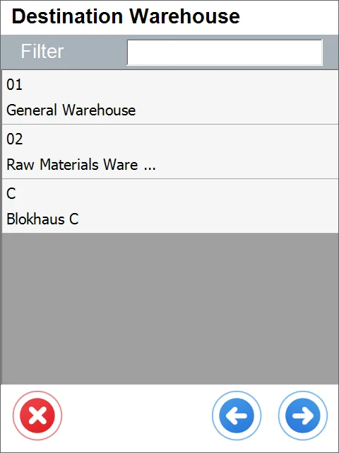

13. If a chosen Warehouse has Bin locations, the To Bin window will appear.

Click the row of a desired Bin or scan its code to choose it.

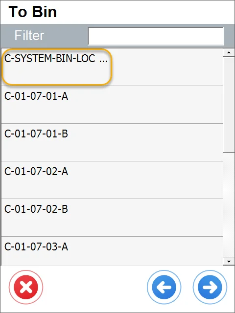

It is possible to set up a default Warehouse. In this case, the Warehouse Selection screen is skipped, and the Warehouse set as default is chosen automatically. It is still possible to go to the Warehouse selection form by clicking a left arrow icon on the Items selection screen.

14. The Put Items window will appear.

Click the Put Items button to set the required quantities for all Items.

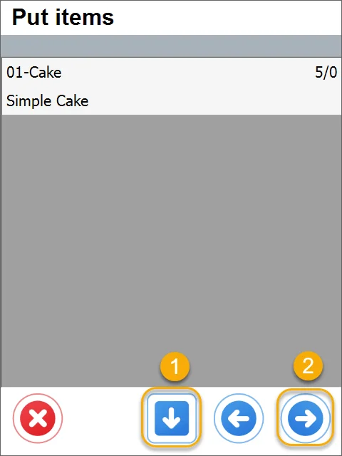

15. You can set details for every item separately. In this case, click a row of a specific Item.

16. The Quantity window will appear (see point 6 of this guide).

17. If an Item is managed by Serial Numbers, a list of copies picked earlier will be displayed after clicking the Item.

Click a serial number row to choose it. If the Warehouse has Bin Locations, the Bin windows will appear. Click a bin’s row to choose it. You can also select it by scanning its code.

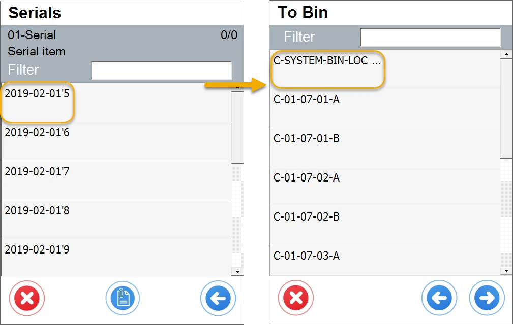

18. If Batches manages an item, the Batch window will appear after clicking it.

Click a row to choose it. The Quantity window will appear (see no. 6 of this guide). If a Warehouse has Bin Locations, the Bin window will appear.

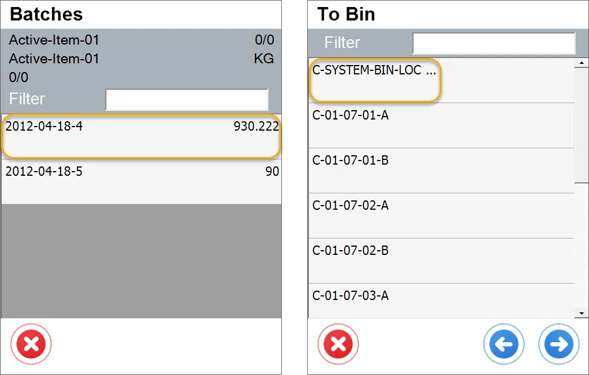

19. Click the right arrow icon to put items to chosen locations after setting document details.

20. The Remarks form will appear. Set Series and optionally Remarks. Click the Save button to save and post the document. (Click here to check how to set Inventory Transfer Request settings).

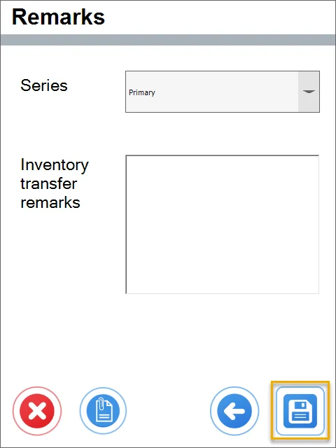

21. A note about the creation of a document is displayed. Click 'OK' to finish the transaction.

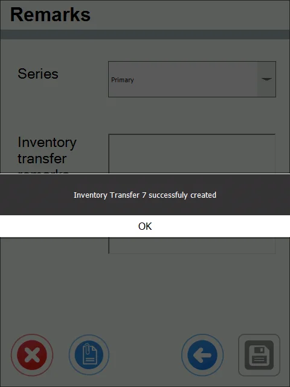

22. An Inventory Transfer is posted and is available in SAP Business One.
