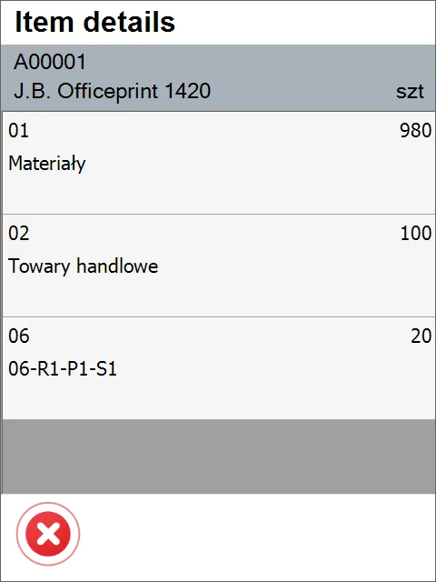

# Warehouse Info

The Lookup process allows quickly searching and displaying inventory information on a specific Warehouse, Batch, Serial, and Item.

---

To check Warehouse Information, click Whs. Info:

Four options are available:

## Item Info

Using this option, you can check the Inventory from an Item perspective.

1. Choosing the Item Info option leads to the list of items. Every Item row contains the Item name, Item number, and overall quantity.

    Users can choose an Item manually by scanning or using arrows. A filter on the list can also be used for Item finding.

    Click a specific Item row to get more details.

    
2. Now we can see the distribution of the Item across Warehouses and Bin Locations:

    

    The header of this screen holds the following information: Item name, Item number, Unit of Measurement, and total quantity from every Warehouse.

    Each row holds the following information: Warehouse\Bin Code, Warehouse name, and quantity in this location.

    
3. The workflow ends here if Batches or Serials do not manage the Item. Otherwise, clicking a Warehouse line leads to either Batch or Serials details.

### Batch-managed Items

Choose a specific Batch row by clicking or using buttons to get more information on:

Specific Batch info is displayed:

The form holds the following information: Batch name, Item name, Item number, Expiry/Manufacturing date, Status, Optional Query Results for "Batch Serial info Details," Quantities on specific Warehouses/Bins. If a user clicks "Right," the arrow will be moved to the next screen where it can be checked where the selected batch is stored.

### Serial-managed Items

If an Item is managed by Serials, choosing it from the Items list and then choosing a Warehouse leads to a list of serial number Items in the specific Warehouse.

## Batch/Serial Info

Go to Warehouse Info > Batch/Serial Info to get information on Batch/Serials:

A list of all Batches/Serials is displayed. Each row contains a Batch/Serial indicator, the name of the Batch/Serial, and related Item code. Click a specific row or scan the Batch\Serial number to get more information. Batch/Serial number can also be scanned – after the scan, a specific Batch/Serial is opened. If the Batch number exists for more than one item, then the Item selection window will appear.

### Batch

The form holds the following information: Batch name, Item name, Item number, Expiry/Manufacturing date, Status, Optional Query Results for "Batch Serial info Details," Quantities on specific Warehouses/Bins. Clicking the "Right" arrow leads to the next screen, where it can be checked where, in other places, the selected batch is stored.

### Serial

Batch/Serial Details for Serial managed Item is similar to the same screen for Batch managed Item.

## Warehouse Info

1. The Warehouse Selection form appears after choosing the Warehouse Info option. Click a specific warehouse to check information about it. You can also choose a value by scanning a bar code without a prefix or with a Warehouse/Bin prefix.

    
2. The Bins form will appear if a picked warehouse has bins defined. Pick one to check the information about it. You can also choose a value by scanning a barcode without a prefix or with a GS1 Warehouse/Bin prefix.

    
3. The Items form will appear, presenting Items in a specified location with their quantity and unit of measurement. Click an Item row or scan a barcode with an Item prefix or without a prefix to see Item details (If Batches or Serial Numbers manage it).

    
4. If Batches or Serial Numbers manage a specific Item, choosing it will display the Batches or Serial Number form. In the Batches form, a batch name will be displayed with a number of Items in a Batch. If an Item is managed by Serial number, all Items with serial numbers will be shown after clicking an Item row. Choose a batch to see its details.

    
5. The Batch Details form will be displayed.

    
6. From this form, you can check the Batch location by clicking the right arrow:

    
7. The Warehouse Info option only displays information – click the x icon to go to the previous form and return to the main menu again.

## SU Info

SU info is an option for Storage Unit location and contents lookup. After choosing it in the Lookups Menu, the list of opened Storage Units will be displayed. Each Row contains U_Code, Warehouse number, and SSCC number. Users can choose Storage Unit manually by clicking, scanning the SSCC number with a prefix, or scanning SU U_Code with a prefix.

The next screen contains a list of items/Storage Units currently contained in the selected SU. To check the content of the child SU, just click on it. Clicking a right arrow will move the user to the screen containing Storage Unit details such as weight SSCC number. If SU is, a child box of another SU in the master SU Field will be placed a number of Master One.

