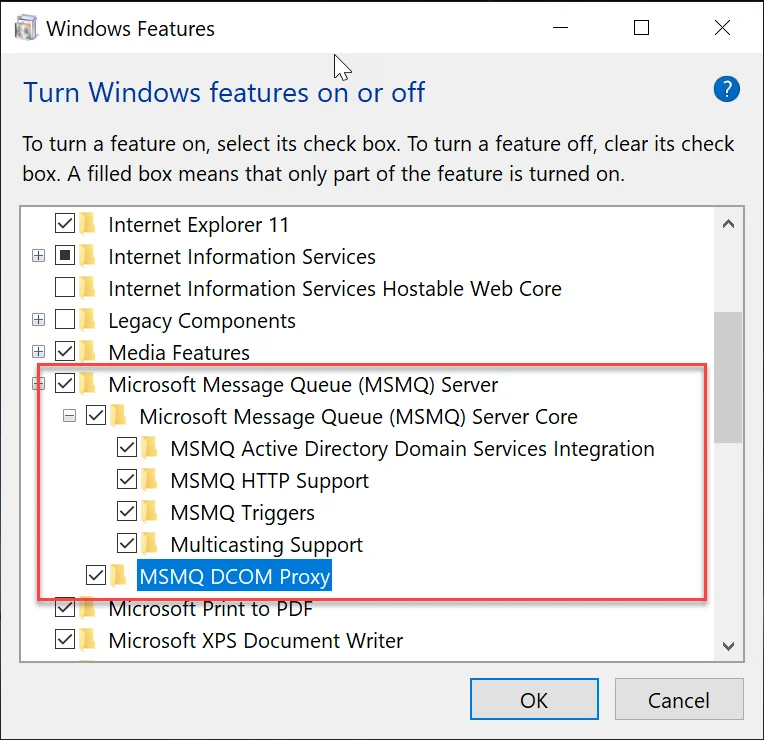

# Configuration of scales for WMS Client for handheld devices

1. Turn on Microsoft Message Queue Server (MSMQ) in the same environment as Gateway Manager:

    1. Open Windows Features

        
2. Install the MSMQ package on the handheld devices with WMS:

    1. Connect the scanner to the PC
    2. Copy the package to the Application location along with CompuTec WMS.
    3. Install the package.
3. WMS integration: click [here](../../administrator-guide/computec-gateway-service/computec-gateway-service-installation.md) for more information.
