# Mettler Toledo weight scale configuration to work with CompuTec WMS

To correctly configure a weight scale, it is required to create a Template and assign it to the weight scale. Next, it is required to choose a work Mode for the scales and finally assign the Template to the scale work Mode.

---

## Defining a Template

- Go to the 'Communication' option in the menu
- Choose the 'Define Template' option
- Choose Template 1 and set up what will be pointed/sent by the weight scale. Set up the following details:

  - Line 1: Date
  - Line 2: Time
  - Line 3: Gross
  - Line 4: Net
  - Line 5: Tare
  - Line 6: SNo. Terminal.

  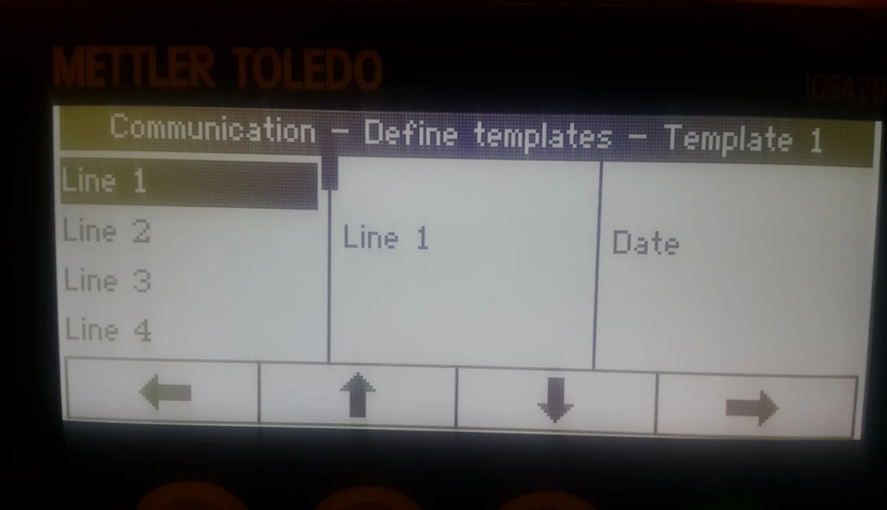

  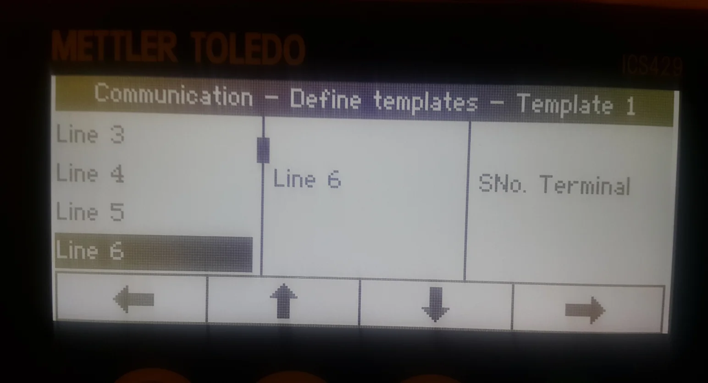

  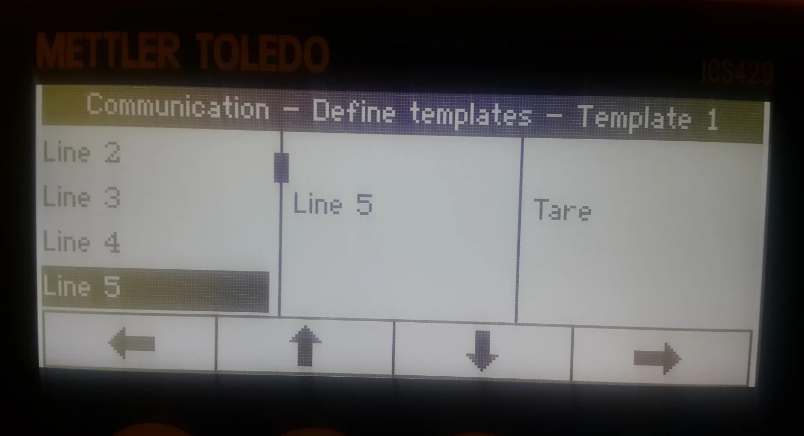

  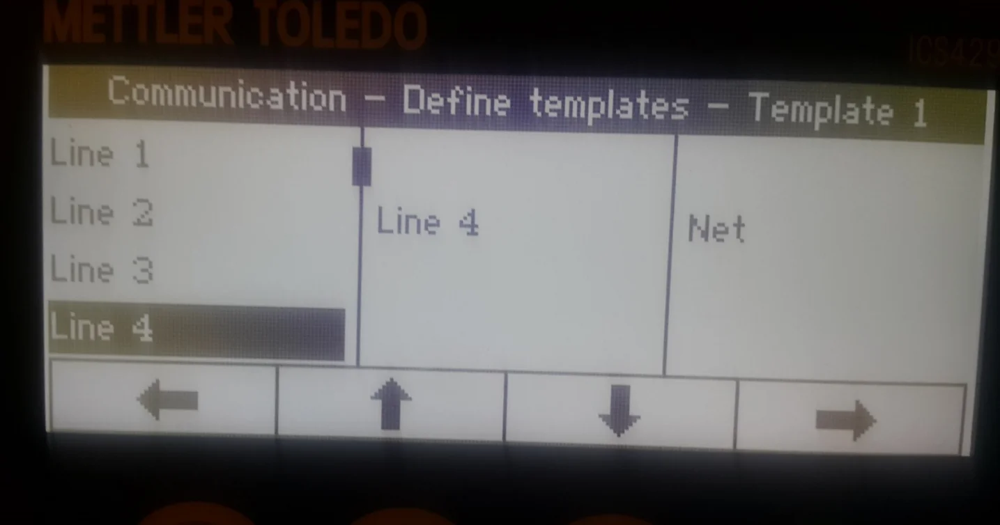

  

  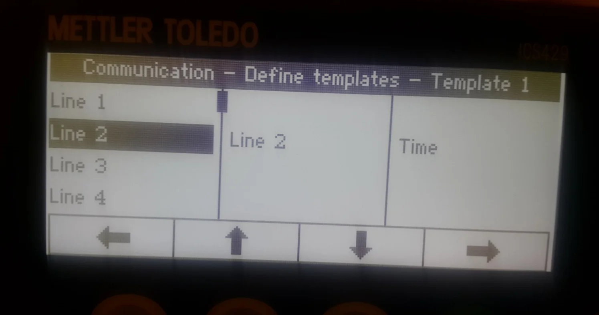

## Choosing a Mode for Weight Scales

- Go to the 'Communication' option in the menu
- choose 'COM2'
- choose 'Mode'
- choose 'Continuous print.'

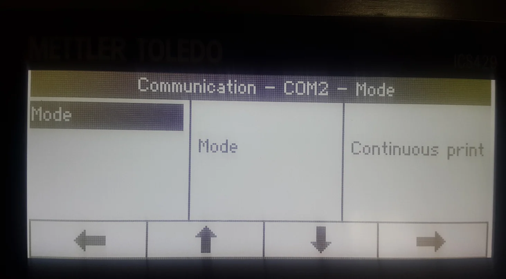

## Assigning the defined Template to the weight scales

- Choose the 'Application' option from the menu.
- choose the 'Straight weighing' option.
- choose 'Printout;
- choose 'COM2'
- choose 'COM2' again
- choose a Template name of the Template that was defined in the first step ('Template 1' in this example)
- click OK to save the changes.

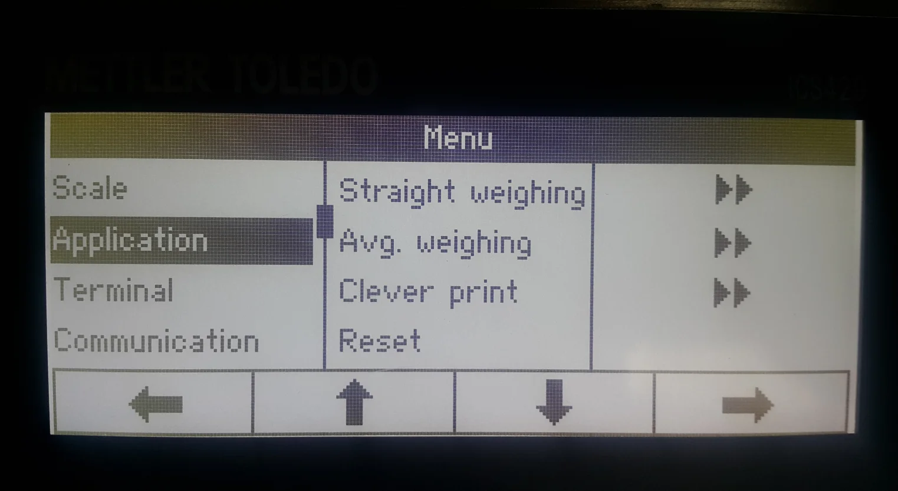

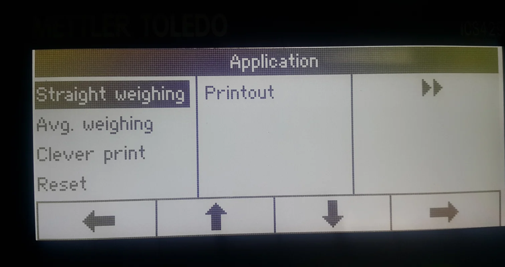

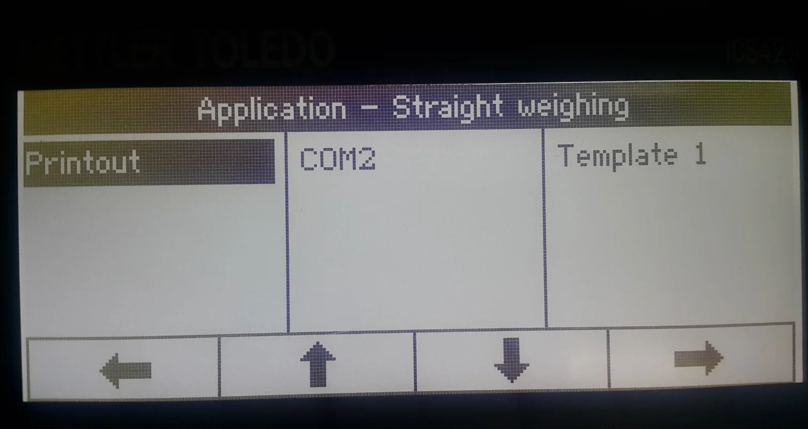

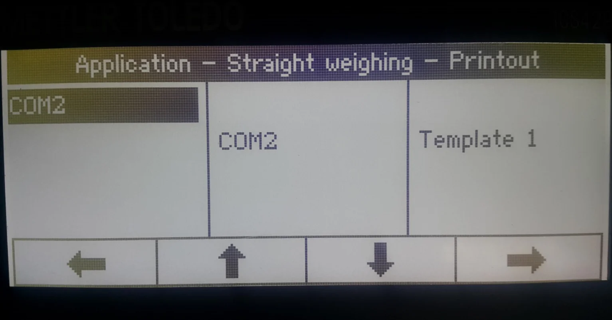

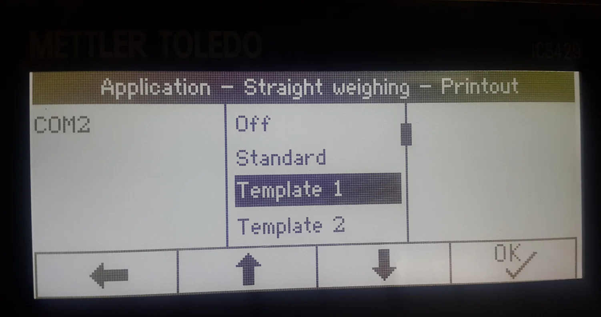

The weight scales are correctly configured and ready to work with CompuTec Gateway and CompuTec WMS 2.0.
