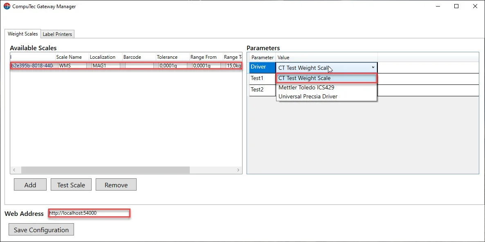
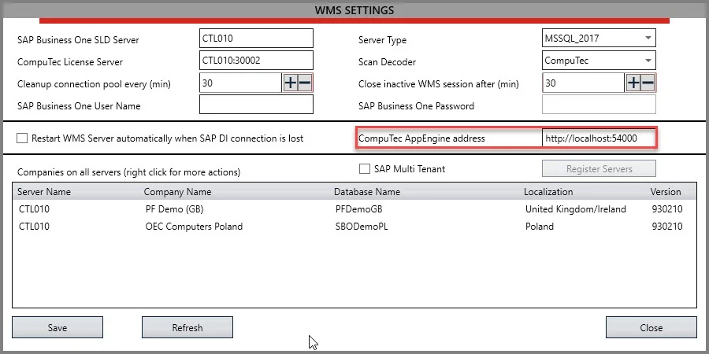
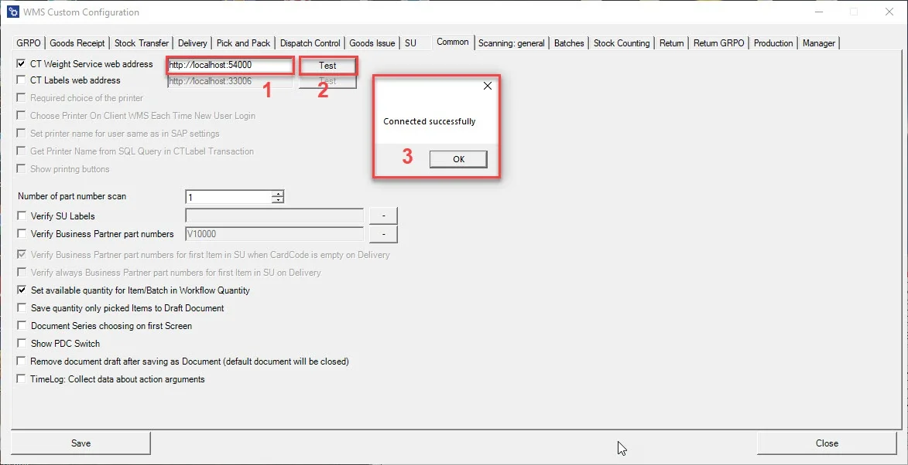
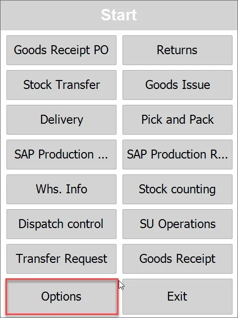
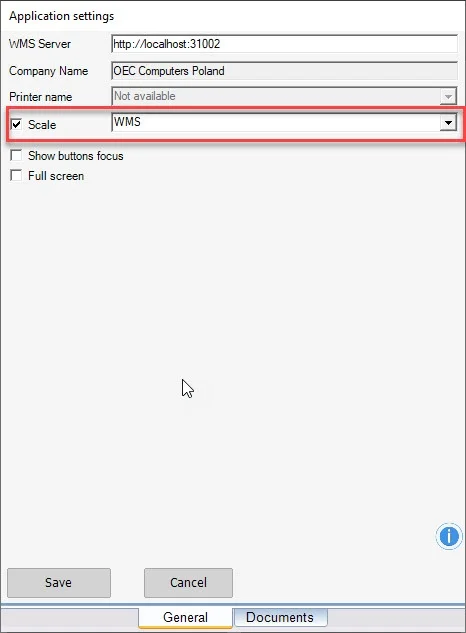
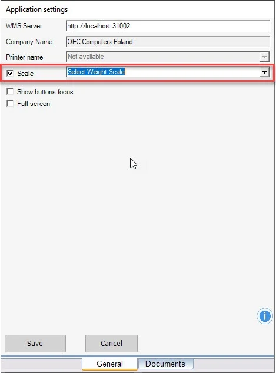
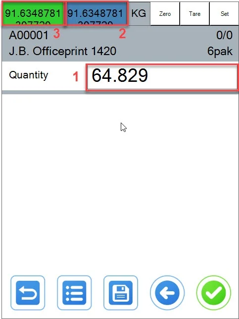
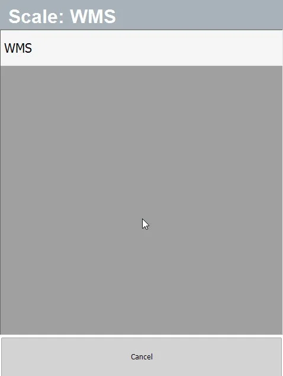

# Overview

Here, you can find instructions on configuring and using weight scales with CompuTec WMS.

---

1. Configure AppEngine and Plugin Gateway Manager from: Weight scales integration.
2. Please remember that address `http://localhost:54000` is the location where you installed your applications f.e. `http://10.0.0.10:54000`
3. Open CompuTec Gateway Manager (Weight Manager).
4. Configure your WMS Weight Scale. I configured the WMS Test Weight Scale in this example, but you should use your own.
5. You can set your Barcode to your Weight Scale.

    
6. Open Custom Configuration, Common tab.
7. Set your AppEngine address:

    
8. Check the CT Weight Service web address option.
9. Test connection/OK.

    
10. Save Custom Configuration and Close.
11. Open WMS Client.
12. Select Options:

    
13. Check the Scale checkbox.
14. Select your WMS Printer:

    
15. Or you can leave this option without choosing any weight scale if you want to use the Scan Barcode option of your weight scale.

    
16. Save configuration.
17. Go to any transaction.
18. Select Quantity window (1).
19. Select (2) or (3) if you want to use your scale(2 Gross, 3 Net).
20. If you want to sum/add another weight to the existing weight, please hold buttons (2) or (3) for 3 seconds.

    
21. You can choose your weight with a Barcode.
22. Click on the button Set in the right corner.
23. Scan your Barcode(from WeightScanManager).

    
