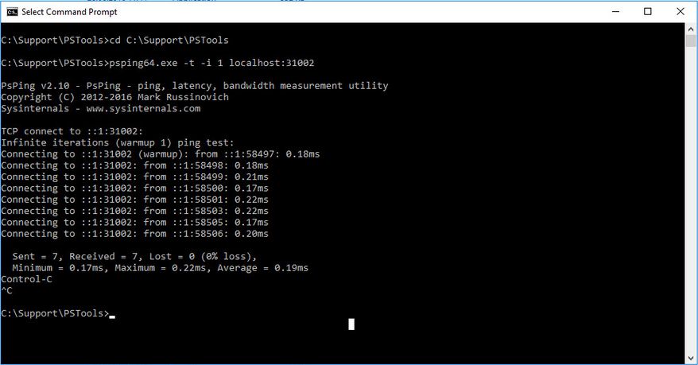
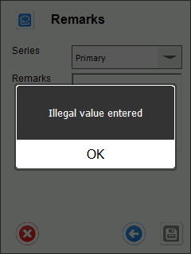

# FAQ

## I have installed WMS components, but it still does not work. What should I do?

1. Configuration
As well as installing WMS components, you must configure the application, e.g., connection to a database. You can find information about that here.

2. Windows firewall inbound rule

Be sure to set a required inbound rule in the Windows firewall. You can check how to do that here.

3. Server and Client connection addresses

Check server and client connection addresses. If both components are installed on the same machine, an entry of “localhost,” e.g., "http://localhost:31002", works, but if the server and the client component are installed on different machines, specific addresses should be written in. You can do that in the options tab on the client application.

To check the connection on ports between server and workstation (in case CompuTec WMs Client operates on a different machine than CompuTec WMS Server), please perform the following steps:

    - Download the PsPing tool from this localization: https://docs.microsoft.com/en-us/sysinternals/downloads/psping and unpack it.

    - Open Windows Command Prompt and navigate to the unpacked PSPing folder, e.g., cd C:\Support\PSTools

    - Run the following commands:

        ```psping64.exe -t -i 1 localhost:31002```

        ```psping64.exe -t -i 1 [remote host IP]:31002```

        Example:



4. CompuTec WMS API Test

Please check if the CompuTec WMS API works correctly by going into a web browser to this address:

http://localhost:31002/API/test/get

http://[remote host IP]:31002/API/test/get

5. WMS services check

Check if CompuTec License Server and CompuTec WMS Server services are up. You can check it in Windows Services - Control Panel > Administrative Tools > Services.

## I have installed the WMS application, but the trial period will expire soon. I purchased a license. How can I get the license file?

You should create an issue on the WMS Support page on support.computec to get the license you purchased (here). Providing accurate information to CompuTec Support will shorten the response time; thus, please check what data are required – check (ADD LINK) here.

## I did not define any bins on any warehouses in my database. Will CompuTec WMS operate properly just in the warehouses?

Yes. CompuTec WMS can operate on bins in the warehouse. However, defining bins is not required for the proper work of the application.

## Illegal value entered communication on document creation



One reason may be a lack of Item Details defined for a specific Item Master Data. Perform the Restore Item Details procedure to fix it. Click here to find out more.

## The WMS database is not installed. Please make sure all prerequisites are met in communication

CompuTec WMS User Define Objects are not installed on a specific SAP Business One database. To fix it, please install UDOs. You can check how to do this (ADD LINK) here.

## Configuration file not found. Please use the settings window for communication

You probably just installed the application, which is still not set up. Please check (ADD LINK) this link to find out more.

I have checked the information in the FAQ section and the rest of this documentation, but I still have no idea why my WMS instance does not work. What should I do?

You should request CompuTec Support assistance by posting an issue within the Support WMS space at support.computec.pl (here). To shorten the problem-solving time needed by CompuTec consultants, you should follow the rules for creating an issue you can find here.

## Data is not displayed correctly

