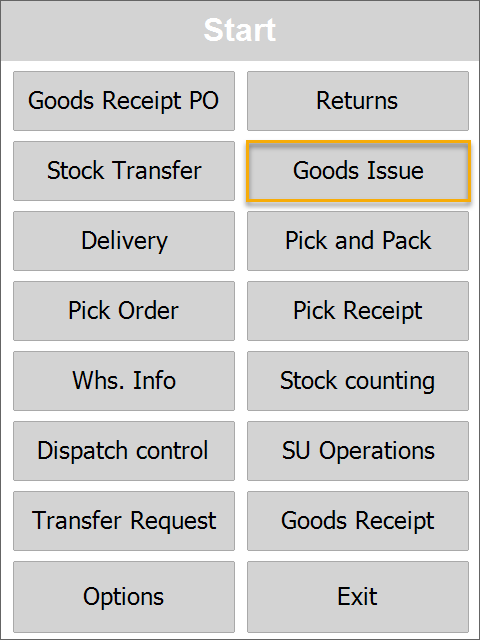
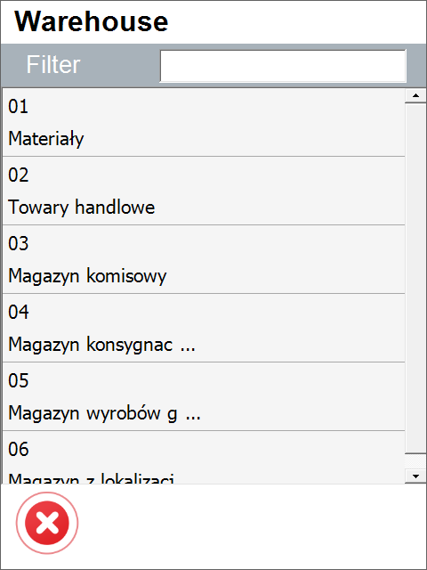
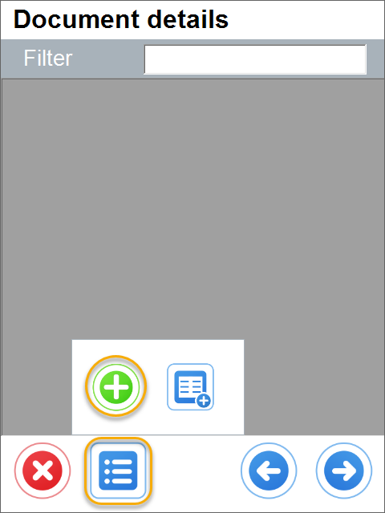

# Goods Issue

Goods Issue documents the company's internal issue of Items or materials.

:::info

Some forms' order and availability during a document's creation may vary depending on individual settings. Click here to find out more.

:::

---

Choose the correct option on the main menu to create a Goods Issue document.

The Source Warehouse form will be displayed.
Choose the desired Warehouse by clicking it. This step can be skipped. In this case, the Source Warehouse selection form will be displayed after choosing a specific Item.
You can choose a Warehouse by scanning a code with a Warehouse prefix or without it.

It is possible to set up a default Warehouse. In this case, the Warehouse Selection screen is skipped, and the Warehouse set as default is chosen automatically.

Click the menu icon and then the plus icon to add Items to the document.

You can scan an Item or SU code in this form, with or without a prefix.

