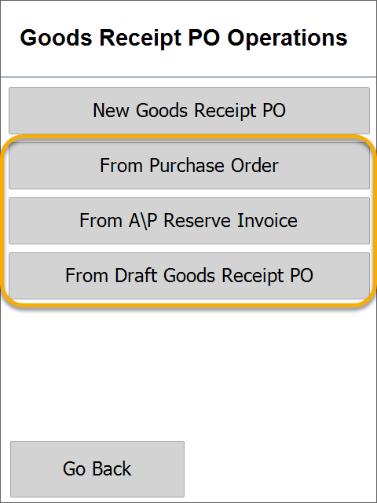
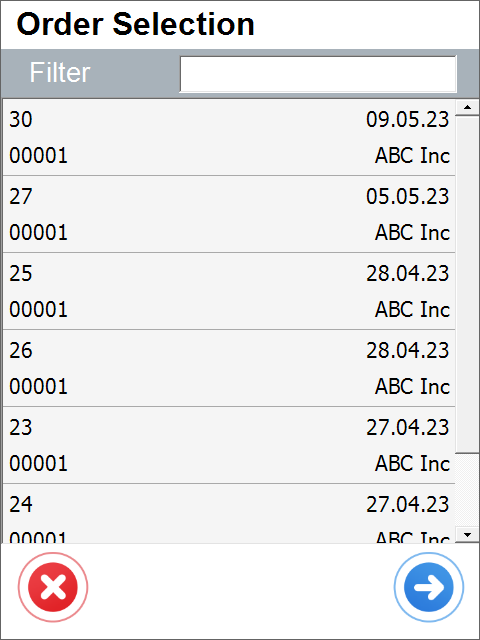

# Based on Existing Document

1. Choose the required type of base document:

  *Please remember that the GRPO A\P Reserve Invoice has to be realized for the same quantity as in the base document.

  

  UDFs for the header have been added. They display a default Warehouse and Bin Location.

2. Choose a document number by clicking its line. You can also scan a barcode or filter using the filter field.

  

UDFs for the header have been added. They display a default Warehouse and Bin Location.

