# New Goods Receipt PO

Choose the Goods Receipt PO option from the main menu:

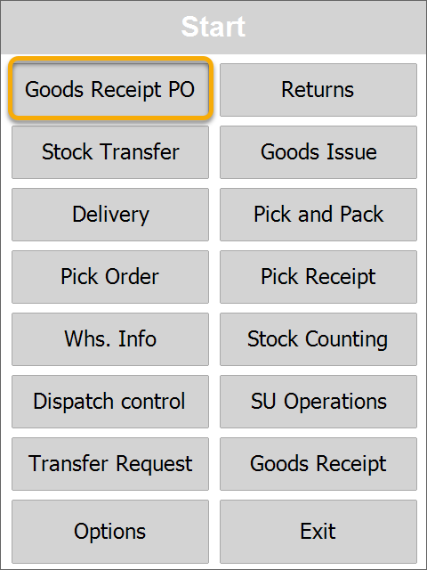

Choose the corresponding option from the Goods Receipt PO Operations menu.

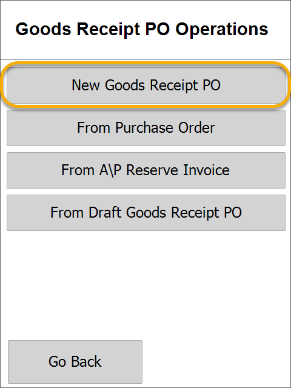

Choose a Supplier (the Warehouse choosing is skipped now).

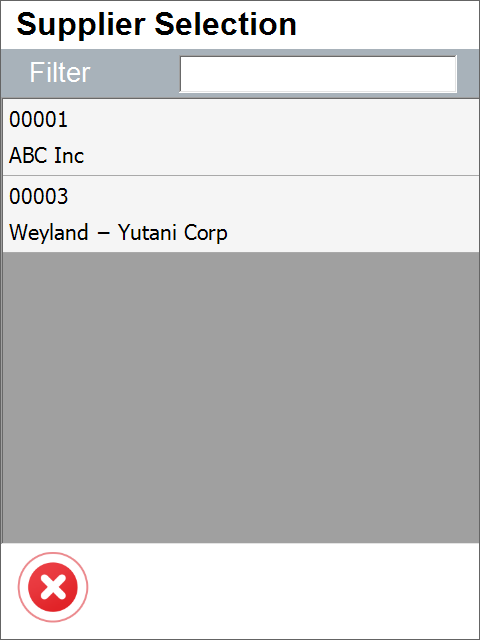

A blank Document Details form is open (along with the Warehouse not selected information):

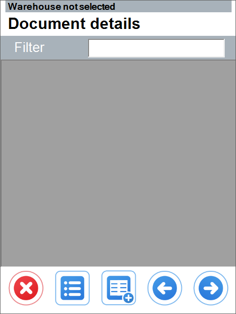

Choose a Warehouse by scanning a barcode (with the 92 prefix) or by choosing it manually (to do it, click the Warehouse not selected info).

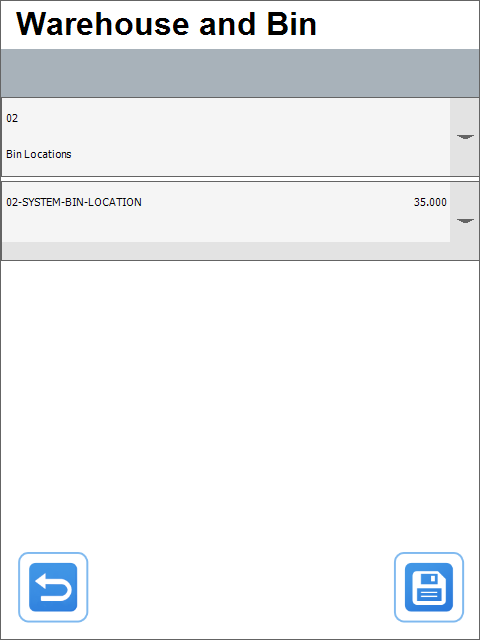

You can also skip the previous step and add a Warehouse for each Item/SU:
Adding an Item without a previously chosen Warehouse:

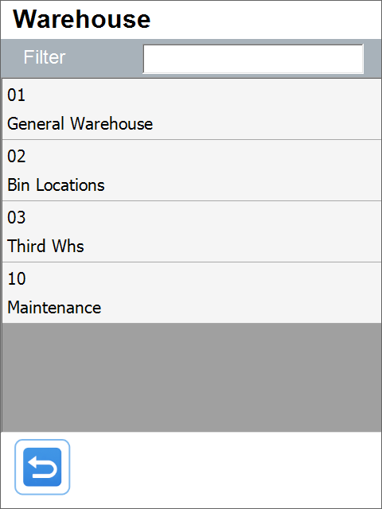

Adding an SU without a previously chosen Warehouse:

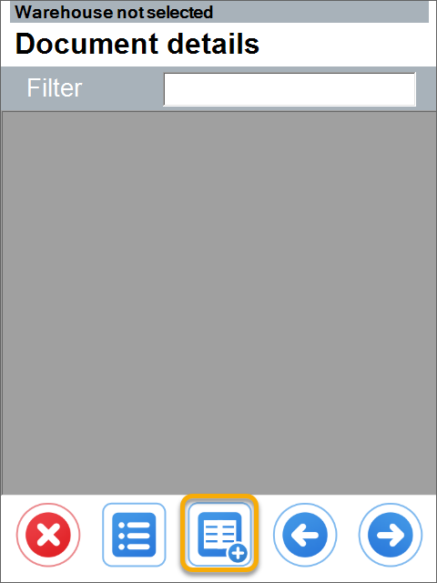

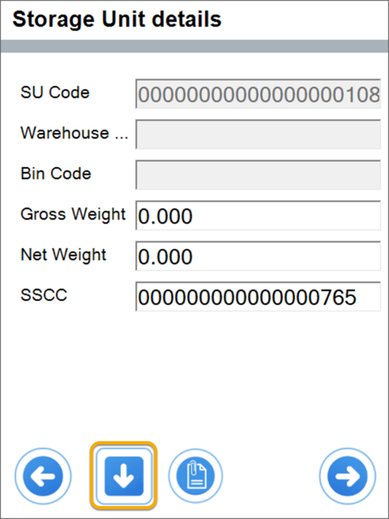

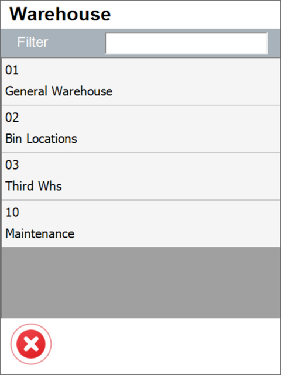

An SU has been added to the document. Now you can add Items to it (manually or by scanning a barcode).

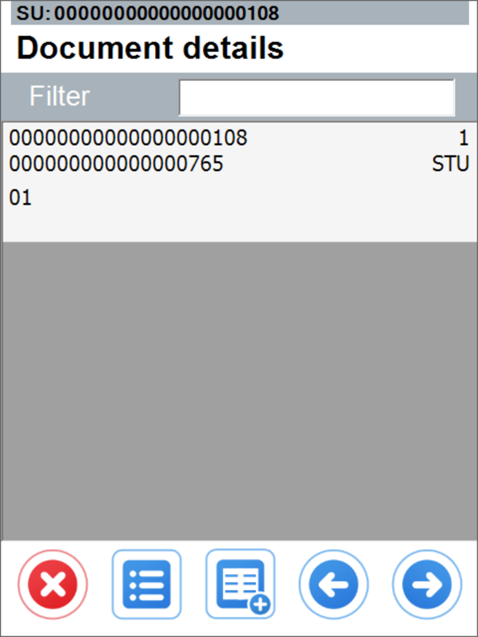

To this SU, you can add a child SU:

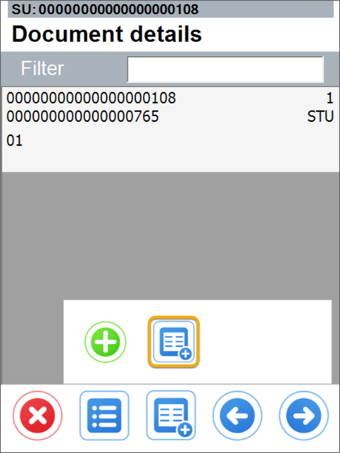

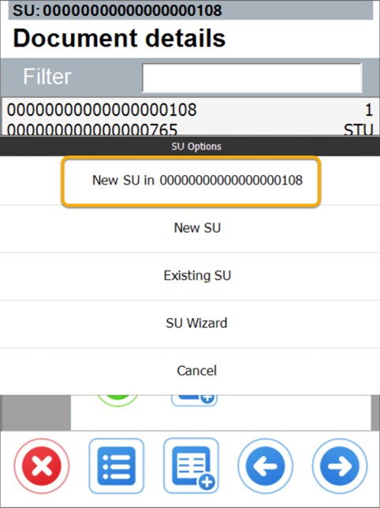

The child a slight dent marks SU:

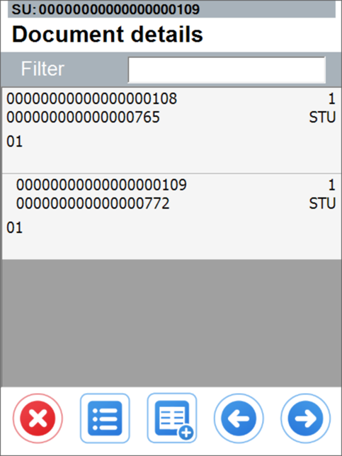

You can also add an existing SU.

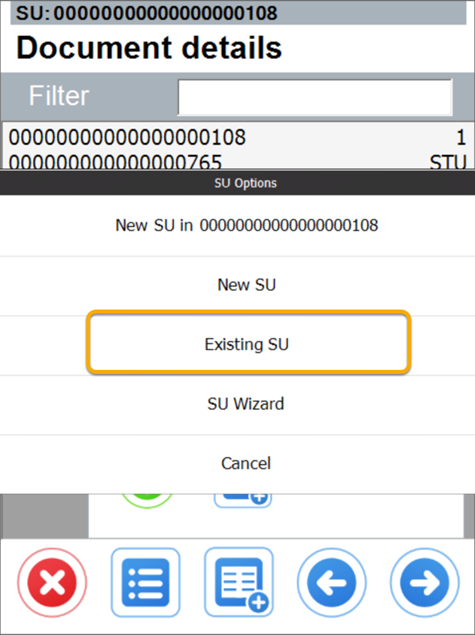

The previous existing SU is highlighted in yellow:

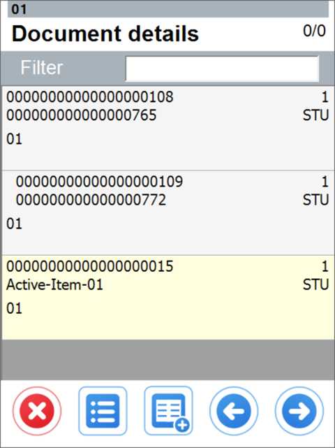

You can add Items and SUs to this and other SUs. You can switch between SUs by scanning their SU Code or SSCC:

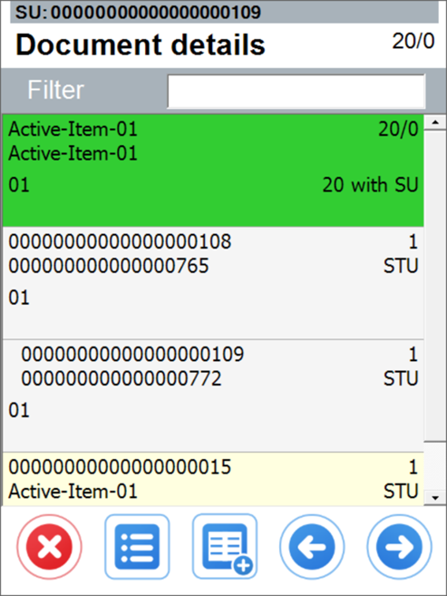

After leaving the SU adding mode (the Warehouse number displayed on the top of the form), you can check the line details (Quantity, SU, or lack of SU).

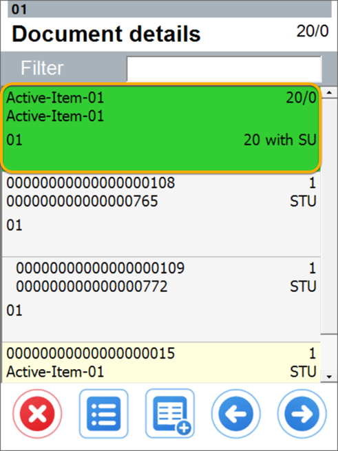

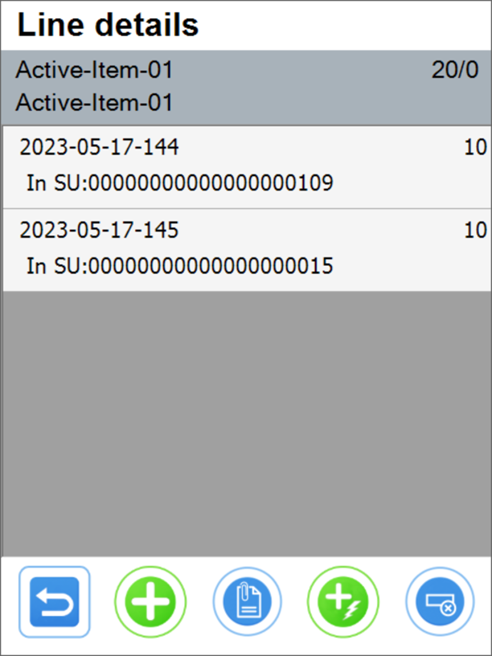

Click the SU to check what elements (Items, SUs) have already been added to the document. In the previously existing SU, you can see only Items added within the current document - not the whole content of the SU.

  An SU with Items:

  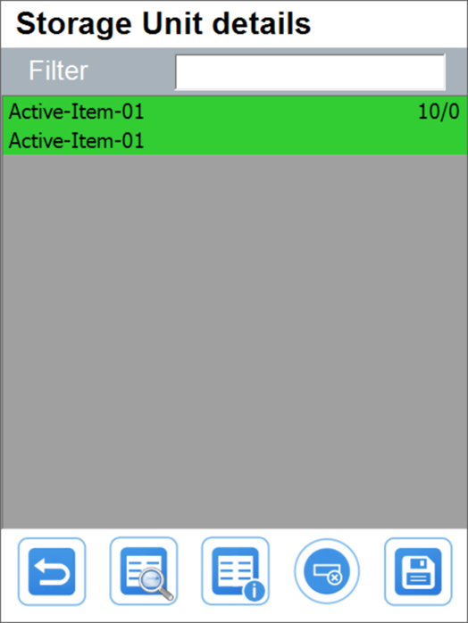

  A parent SU with a child SU:

  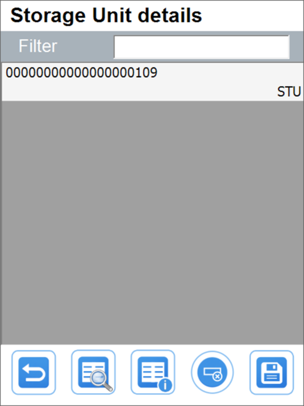

Now you can check the document details:

Now you can check the Remarks and Save the document (the lower right icon):

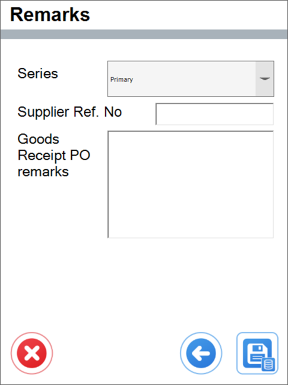
