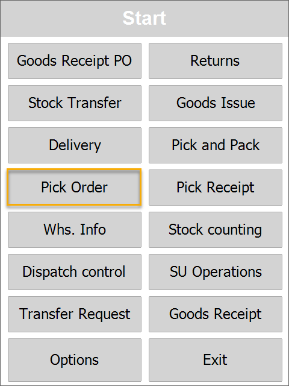
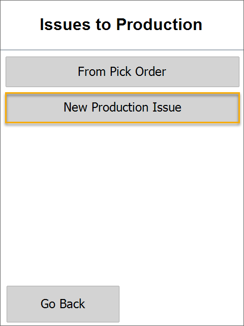

# New Production Issue

The Pick Order transaction allows generating a ProcessForce Production Issue.

:::note
The order and availability of some of the forms during a document's creation may vary depending on individual settings. Click here to find out more.
:::

1. To create a Production Issue from a Pick Order, click Pick Order in the main menu.

  

  

