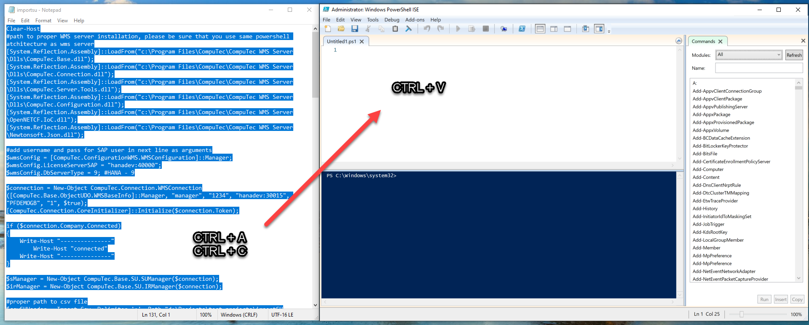
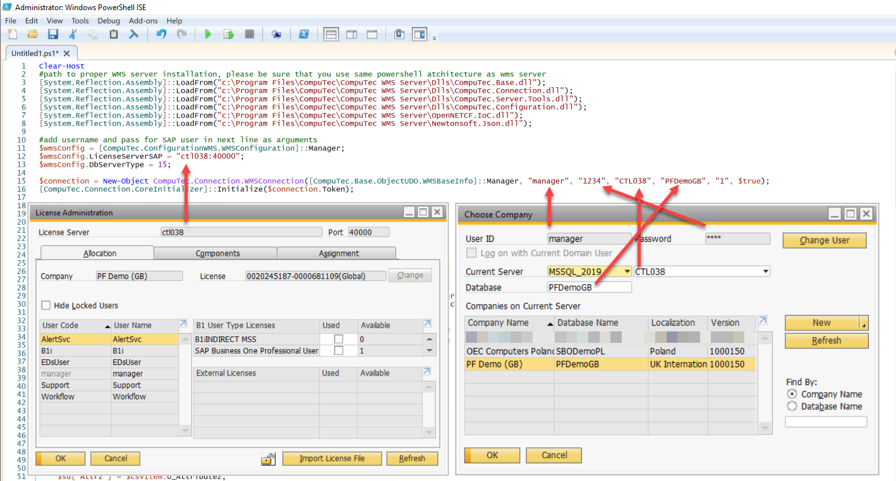
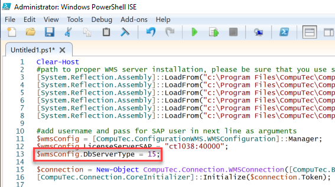
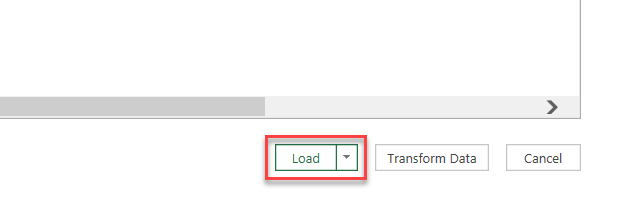

# Storage Unit import with Powershell

## Usage

1. Download the files from here.

2. Run Powershell ISE (x64 or x86) as Administrator:

  

3. Open the ImportSU file in Notepad, copy and paste it to the **Windows Powershell ISE**:

  

4. Enter correct credentials (login and password from CompuTec WMS):

  

5. Enter database server type:

  

  dst_MSSQL = 1,

  dst_DB_2 = 2,

  dst_SYBASE = 3,

  dst_MSSQL2005 = 4,

  dst_MAXDB = 5,

  dst_MSSQL2008 = 6,

  dst_MSSQL2012 = 7,

  dst_MSSQL2014 = 8,

  dst_HANADB = 9,

  dst_MSSQL2016 = 10,

  dst_MSSQL2017 = 11,

  dst_MSSQL2019 = 15

6. Enter the proper path to the .csv files:

  

7. Copy BusinessObjects folder from CompuTec WMS to C:\Windows\System32\WindowsPowerShell\v1.0:

  

8. Run the script.

## CSV files preparation

1. Download the files from here.

2. Open Microsoft Excel.

3. Go to Data tab and open From text/CS:

  

4. Open SUHeader.csv / SULines.csv.

5. From the drop-down menu: Data Type Detection select Do not detect data types. Then press:

  

  

6. Right-click on the following columns: U_Code, U_WhsCode, U_BinCode, U_SSCC (U_Parent as well, if you create SU in SU) and change the type from General to Text:

7. Enter proper data: new, different U_Code and U_SSCC, correct warehouse and bin codes. Check the U_BinAbs (AbsEntry from OBIN)

  

  

8. Enter the proper data for the following SULines: ItemCode, Quantity, Manage Type, Item Type and DistNumber. Remember, that the Code must be the same as U_Code from SUHeader.

  

9. Save the files as CSV UTF-8 (comma delimited):
XYZ depends on your region. It may be ; or ,. Remember about setting it in the script:

  

10. Open the files in Notepad and remove the first row:

  
